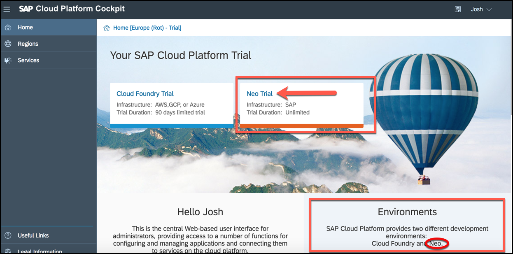
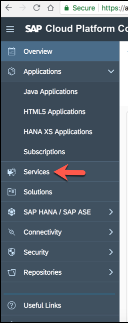
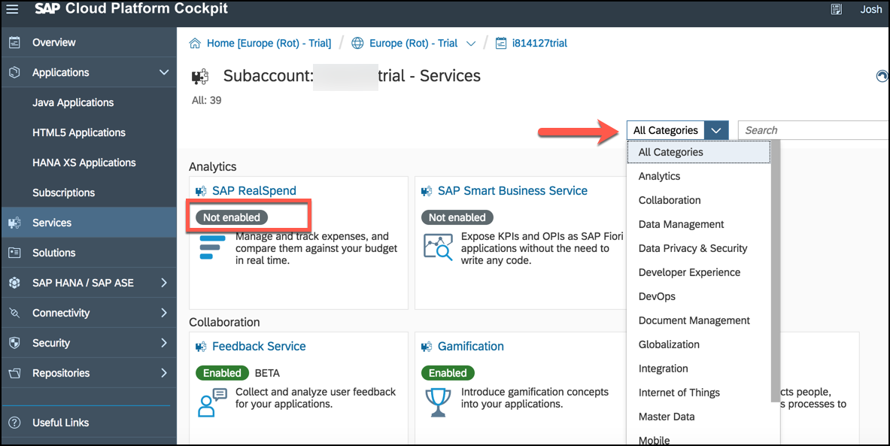
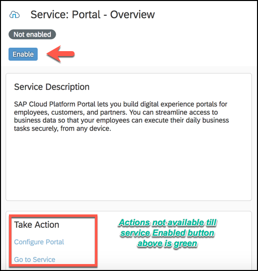
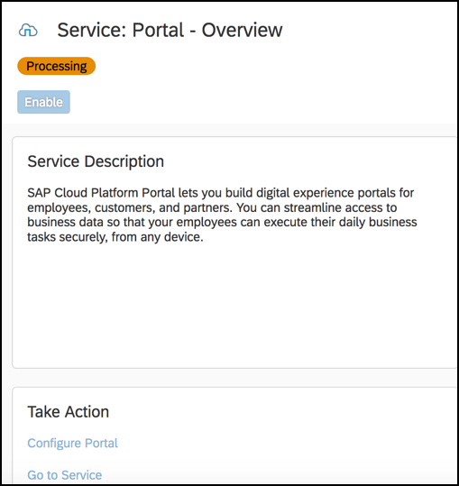

## Prerequisites
 - You must have an account on the **SAP Cloud Platform**, see here on how to gain access [SAP Cloud Platform](https://cloudplatform.sap.com/index.html)
 - Learn how to sign up for a free trial via this tutorial [SAP Cloud Platform sign up](https://www.sap.com/developer/tutorials/hcp-create-trial-account.html)

## Details
### You will learn
  - Where to find the services section and the associated categories
  - How to enable a new service for your development environment

[ACCORDION-BEGIN [Step 1: ](Navigate to the services section)]

In the Neo environment, you enable services in the SAP Cloud Platform cockpit.  From the [SAP Cloud Platform Trial welcome page](https://account.hanatrial.ondemand.com/#/home/welcome) homepage select the Neo tile.

Once logged in, you will find the services in the Neo Environment can be found on the left side menu by clicking on **Services**:

The cockpit will now list all services grouped by service category.

Some of the services are basic services, which are provided with SAP Cloud Platform and are ready-to-use. In addition, extended services are available. A ***green*** or ***gray*** label on the tile for a service indicates if this service is enabled/not enabled.

You must first enable the service and apply the service-specific configuration (for example, configure the corresponding roles and destinations) before any `subaccount` members can use it.

The term ***essential*** may mean different things to different developers, but this is a short list I would start with.

- User Management - Identity Provisioning
- Data Management - SAP HANA
- Data Privacy & Security - OAuth 2.0
- Developer Experience - SAP Web IDE Full-Stack
- Integration `OData` Provisioning
- Mobile - Development & Operations, `std`

[DONE]
[ACCORDION-END]

[ACCORDION-BEGIN [Step 2: ](Enable a service)]

Now let's enable one of the services listed above.

Click on the tile for **Portal** *Service* from the tile in the *User Experience section*, or from the services menu drop down for *User Experience*. You can also search for any service by name.

The service description will give you a definition of what the service you are going to enable does.

When ready to enable the service simply click the **Enable** button.

The status will change to ***processing***

Now after a few moments, you should see the **Enabled** button has changed to green and the action items for the service are now active.

[VALIDATE_1]
[ACCORDION-END]
