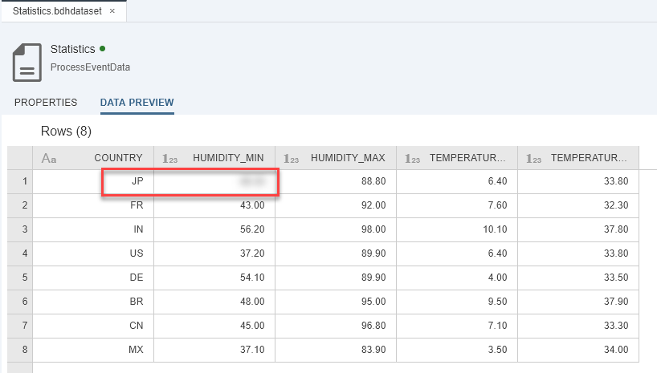

## Prerequisites  
 - **Proficiency:** Beginner
 - You have completed [Create workflow (part 1): Enrich data with flowgraph](https://www.sap.com/developer/tutorials/datahub-trial-workflow-part01.html)

## Next Steps
 - [Create workflow (part 3): Build a workflow ](https://www.sap.com/developer/tutorials/datahub-trial-workflow-part03.html)

## Details
### You will learn  
During this tutorial, you will build on what you have learned during the previous tutorial about flowgraph. You will build a more complicated flowgraph now. This will aggregate the `Events.parquet` file per country. It will store the result of the aggregation in a table in SAP Vora:

- Minimum humidity per country
- Maximum humidity per country
- Minimum temperature per country
- Maximum temperature per country

### Time to Complete
**30 Min**

---

[ACCORDION-BEGIN [Step 1: ](Create table in SAP Vora)]
To be able to store data in SAP Vora, you first need to create a table. Thereto open the SAP Data Hub Cockpit (`https://vhcalhxedb:51076/`) via a web browser.

Enter `DATAHUB` as **HANA Username** and the password which you have selected during system setup as **HANA Password** to logon to SAP Data Hub Cockpit. The system displays the **Overview** page.

  

Navigate to the **SAP Vora Tools** by clicking **link (1)** on the bottom of the screen. You have to logon again. Enter `default` as **Tenant ID**, `DATAHUB` as **Username** and the password which you have selected during system setup as **Password**. The system displays the **SAP Vora Tools**.

  

Create a new relational table by pressing the **Create New (2)** button.

  

Enter the following information (and leave the remaining fields blank) to create the relational table and then click **Next (3)** :

| Field                          | Value                                                         |
| ------------------------------ | ------------------------------------------------------------- |
| `Name`                         | `STATISTICS_DATA`                                             |
| `Schema`                       | `VORA`                                                        |
| `Engine`                       | `Relational`                                                  |
| `File Type`                    | `CSV`                                                         |
| `Delimiter`                    | `;`                                                           |
| `File System`                  | `GCS`                                                         |


Create the following columns:

| Name              | Data Type | Length | Precision | Scale |
| ----------------- | --------- | ------ | --------- | ----- |
| `COUNTRY`         | `VARCHAR` | 2      |           |       |
| `HUMIDITY_MIN`    | `DECIMAL` |        | 12        | 2     |
| `HUMIDITY_MAX`    | `DECIMAL` |        | 12        | 2     |
| `TEMPERATURE_MIN` | `DECIMAL` |        | 12        | 2     |
| `TEMPERATURE_MAX` | `DECIMAL` |        | 12        | 2     |

  

Finally click **Finish** to create the table.

[DONE]

[ACCORDION-END]

[ACCORDION-BEGIN [Step 2: ](Create data sets)]
Navigate to the **SAP Data Hub Modeling tools** (via the SAP Data Hub Cockpit) and open the project which you created  during the previous tutorial.

Create a data set for the `Events.parquet` files via the menu **New > Data Set**. Enter `Events` as **Name** and `GCS_CONN_DEFAULT` as **Destination**. Then click **Create**.

  

Enter the following information:

| Field&nbsp; &nbsp; &nbsp; &nbsp; &nbsp;&nbsp; &nbsp; &nbsp; &nbsp;&nbsp;&nbsp;&nbsp;&nbsp;&nbsp;&nbsp;&nbsp;&nbsp;&nbsp;&nbsp;&nbsp;&nbsp;&nbsp;                            | Value                                                                  |
| ------------------------------ | ---------------------------------------------------------------------- |
| `Description`                  | `Events (Google Cloud Storage)`                                        |
| `File Path`                    | file via **Browse** button, in our case `datahub-trial/Events.parquet` |
| `File Format`                  | `Parquet`                                                              |

Then click **Show Structure** and directly afterwards the **Auto Propose** button.

  

Use the **Activate** button to activate the data set.

Create a data set for the `STATISTICS_DATA` table via the menu **New > Data Set**. Enter `Statistics` as **Name** and `VORA_CATALOG_CONN_DEFAULT` as **Destination**. Then click **Create**.

  

Enter the following information:

| Field                          | Value                                                               |
| ------------------------------ | ------------------------------------------------------------------- |
| `Description`                  | `Statistics (SAP Vora)`                                             |
| `Schema Name` and `Table Name` | table via **Browse** button, in our case `VORA.STATISTICS_DATA`     |

Then click **Show Structure** and directly afterwards the **Auto Propose** button.

  

Use the **Activate** button to activate the data set.

[DONE]

[ACCORDION-END]

[ACCORDION-BEGIN [Step 3: ](Create flowgraph task)]
Now you create a flowgraph task to aggregate the `Events.parquet` file per country via the menu **New > Task**. Enter `CalculateStatistics` as **Name** and `Flowgraph` as **Type**. Then click **Create**.


Select `Events` and `EnrichedDevices` as **Source** and `Statistics` as **Target** data set. Also enter `Calculate Statistics` as **Description**.

Click the **Add node button (1)** followed by the **Join button (2)** as displayed in the following screenshot :


Connect the `Events` data set with the `JOIN_IN` port of the **Join** and connect the `EnrichDevices` data set with the `JOIN_IN_1` port of the **Join**. The flowgraph now looks like this :


Then click **configure** button of the **Join**. The following screen opens:


Here you select that the following columns are read from the two data sets. Ensure that the `VALUE` **Source Column** maps to two **Output Columns**, namely `MIN` and `MAX`.

| Source            | Source Column  | Input Port  | Output Column |
| ----------------- | -------------- | ----------- | ------------- |
| `Events`          | `DEVICE`       | `JOIN_IN`   | `DEVICE`      |
| `Events`          | `EVENT`        | `JOIN_IN`   | `EVENT`       |
| `Events`          | `TIME`         | `JOIN_IN`   | `TIME`        |
| `EnrichedDevices` | `COUNTRY`      | `JOIN_IN_1` | `COUNTRY`     |
| `Events`          | `VALUE`        |             | `MIN`         |
| `Events`          | `VALUE`        |             | `MAX`         |

Then you navigate to the **Criteria** tab.


Here you maintain an **Inner join** between the `Events` data set and the `EnrichDevices` data set. Then click on the `There are no conditions` **link**.


Enter the following the following join condition.

```sh
"Join_IN"."DEVICE" = "Join_IN_1"."DEVICE"
```

Then press two times **Apply** and finally add an **Aggregation** by clicking **Add Node**. The flowgraph now looks like this:


Connect the `JOIN_OUT` port of the **Join** with the `IN` port of the **Aggregation**.


Then click **configure** button of the **Aggregation**. The following screen opens:


Here define the aggregation of the data.

| Column Name       | Column Type    | Action     |
| ----------------- | -------------- | ---------- |
| `COUNTRY`         | `NVARCHAR`     | `GROUP-BY` |
| `EVENT`           | `NVARCHAR`     | `GROUP-BY` |
| `MIN`             | `DECIMAL`      | `MIN`      |
| `MAX`             | `DECIMAL`      | `MAX`      |

Then press **Apply** and add an **Pivot** node by clicking **Add Node**. The flowgraph now looks like this:


Connect the `OUT` port of the **Aggregation** with the `IN` port of the **Pivot** node.


Then click **configure** button of the **Pivot** node. The following screen opens:


On this screen it is quite easy to make errors. Please proceed as follows to ensure that the system pivots the event data correctly.

Select the **Axis Attributes (3)**. Thereto first click on `Click to select axis` to select `EVENT` as **Axis Column**. Then press the **+ Add Values** button two times and maintain the following axis attributes.

| Value                          | PREFIX                                                |
| ------------------------------ | ----------------------------------------------------- |
| `humidity`                     | `HUMIDITY`                                            |
| `temperature`                  | `TEMPERATURE`                                         |

Select the **Output Columns (4)** to be passed through. Thereto click **+Pass Through** and select the `COUNTRY` column.
**Remark**: You do not need to worry about the other output columns for now.

Next select the **Data Columns (5)**. Thereto click **+** and select the `MIN` as well as `MAX` column.
**Remark**: this will automatically create four additional output columns `HUMIDITY_MIN`, `TEMPERATURE_MIN`, `HUMIDITY_MAX`, `TEMPERATURE_MAX.`

Finally select `First Row` as **Duplicate Strategy (6)** and click **Apply**. Last not least, connect the `OUT` port of the **Pivot** node with the `Statistics` data set. The flowgraph now looks like this:


Use the **Activate** button to activate the flowgraph.

[DONE]

[ACCORDION-END]

[ACCORDION-BEGIN [Step 4: ](Execute flowgraph task)]
Now execute the flowgraph task. You can do this via the context menu **Execute**.

You see the log view. Refresh the log view by clicking **Refresh** until the status of the task is **OK**.


**Remark**: Even though the data volume is comparatively small, it profiling can take comparatively long to complete. Profiling uses Apache Spark and it takes time to spin up the Spark workers.

[DONE]

[ACCORDION-END]

[ACCORDION-BEGIN [Step 5: ](Check result)]
Now check the result of the flowgraph task. Thereto open the `Statistics` data set and navigate to the **DATA PREVIEW** tab.



You see the aggregated maximum and minimum humidity as well as temperature. Using the above screenshot and your generated `Statistics` data set, answer the below question.

[VALIDATE_1]

[ACCORDION-END]

---

