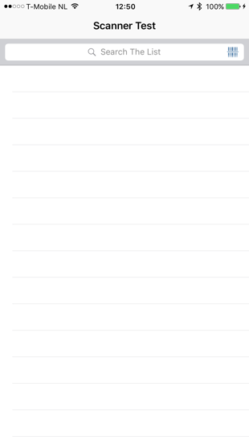
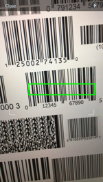
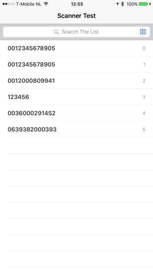

## Prerequisites  
 - **Proficiency:** Beginner
 - **Development machine:** Access to a Mac computer
 - **Target device:** A physical iPad or iPhone running iOS 10


## Next Steps
 - Select a tutorial group from the [Tutorial Navigator](https://www.sap.com/developer/tutorial-navigator.html) or the [Tutorial Catalog](https://www.sap.com/developer/tutorial-navigator.tutorials.html)

## Details
### You will learn  
In this tutorial, you learn how to implement the `FUISearchBarcodeScanner` protocol to scan barcodes and QR codes. This tutorial is not intended as a real-world example, but merely shows the working of the barcode functionality.

To follow this tutorial you should have access to an iPhone or iPad running iOS 10 since the Xcode Simulator does not provide access to a camera.

### Time to Complete
**15 Min**

---

[ACCORDION-BEGIN [Step 1: ](Create new project)]

Open Xcode, and from the menu **File > New > Project** choose a new **Single View Application**.

Enter a product name, for instance `ScannerTest`, and specify a location to store the project.

When finished, you should have a very simple project like this:


[DONE]
[ACCORDION-END]

[ACCORDION-BEGIN [Step 2: ](Add SDK Framework files)]

Select the project definition and scroll down to the **Embedded Binaries** panel:


Open a **Finder** window and locate the location of the SDK Framework files:


Drag the following files to the **Embedded Binaries** section of your project:

- `SAPCommon.framework`
- `SAPFiori.framework`
- `SAPFoundation.framework`

In the dialog that appears, make sure **Copy items if needed** is checked and click **Finish**:


Your project should now contain the necessary SDK framework files:


[DONE]
[ACCORDION-END]

[ACCORDION-BEGIN [Step 3: ](Add Table View Controller)]

Open the **Storyboard** and and remove the **View Controller** in the scene.

From the **Object library**, drag a **Navigation Controller** into the scene.


Select the **Navigation Controller**, and check **Is Initial View Controller**:


Select the **Table View Controller Header** and set the title to **Scanner Test**:


[DONE]
[ACCORDION-END]


[ACCORDION-BEGIN [Step 4: ](Add Table View Controller class)]

From the menu select **File > New > File...** and from the dialog, select **Cocoa Touch Class**:


Click **Next**.

Provide a name for the class, and make sure it implements `UITableViewController`:


Click **Next** and then **Create**


[DONE]
[ACCORDION-END]

[ACCORDION-BEGIN [Step 5: ](Implement Table View Controller class)]

Add the following import statement:

```swift
import SAPFiori
```

Then, add the following fields:

```swift
var searchController: FUISearchController?
var scannedBarcodes: [String] = []
var filteredBarcodes: [String] = []
var isFiltered: Bool = false
```

Next, have the class implement `UISearchResultsUpdating` which be used to update search results.

If you now build the project, it will throw an error stating:

> `type 'ScannerTestController' does not conform to protocol 'UISearchResultsUpdating'`

.

This is because we haven't implemented this protocol's method `updateSearchResults(for searchController:)` yet. Add the following method:

```swift
func updateSearchResults(for searchController: UISearchController) {

    guard let searchString = searchController.searchBar.text, !searchString.isEmpty else {
        self.isFiltered = false
        self.filteredBarcodes.removeAll()
        self.tableView.reloadData()
        return
    }

    self.isFiltered = true
    self.filteredBarcodes = scannedBarcodes.filter({
        return $0.localizedCaseInsensitiveContains(searchString)
    })
    self.tableView.reloadData()
}
```

This code checks whether a search string is entered in the search bar, sets the `isFiltered` flag and filters the list accordingly. If no search string exists, it returns the unfiltered list.

In method `viewDidLoad()`, add the following lines of code:

```swift
tableView.register(FUIObjectTableViewCell.self, forCellReuseIdentifier: "FUIObjectTableViewCell")

searchController = FUISearchController(searchResultsController: nil)
searchController!.searchResultsUpdater = self
searchController!.searchBar.placeholderText = "Search The List"

searchController!.searchBar.isBarcodeScannerEnabled = true
searchController!.searchBar.barcodeScanner?.scanResultTransformer = { (scanString) -> String in
    self.scannedBarcodes.append(scanString)
    return scanString
}

tableView.tableHeaderView = searchController?.searchBar
```

This code adds the Search Bar and attaches the Barcode Scanner to it. Upon successful scanning, the scanned results will be added to the `scannedBarcodes` list.

So no you have the scanning part ready, but nothing yet to show in the Table View.

Modify method `numberOfSections(in tableView:)` to return 1:

```swift
override func numberOfSections(in tableView: UITableView) -> Int {
    return 1
}
```

...and modify method `tableView(_ tableView:, numberOfRowsInSection section:)` to return the correct number of rows for both filtered as well as unfiltered results:

```swift
override func tableView(_ tableView: UITableView, numberOfRowsInSection section: Int) -> Int {
    return isFiltered ? self.filteredBarcodes.count : self.scannedBarcodes.count
}
```

Finally, implement the method `tableView(_ tableView:, cellForRowAt indexPath:)`:

```swift
override func tableView(_ tableView: UITableView, cellForRowAt indexPath: IndexPath) -> UITableViewCell {
    let cell = tableView.dequeueReusableCell(withIdentifier: "FUIObjectTableViewCell", for: indexPath)
    guard let objectCell = cell as? FUIObjectTableViewCell else {
        return cell
    }
    objectCell.headlineText = isFiltered ? filteredBarcodes[indexPath.row] : scannedBarcodes[indexPath.row]
    objectCell.statusText = String(indexPath.row)

    return objectCell
}
```

[DONE]
[ACCORDION-END]

[ACCORDION-BEGIN [Step 6: ](Attach custom class to Table View Controller)]

Go to the **Storyboard**, select the **Scanner Test** controller, and assign it to the custom class:


[DONE]
[ACCORDION-END]

[ACCORDION-BEGIN [Step 7: ](Update info.plist file)]

Since the Barcode Scanner uses the camera, you need to give permissions to the app to use it.

Open the `info.plist` file and add the following entry:

| Key | Value |
|----|----|
| Privacy - Camera Usage Description | `$(PRODUCT_NAME) needs to use the camera as a barcode scanner` |


[DONE]
[ACCORDION-END]

[ACCORDION-BEGIN [Step 8: ](Scan barcodes)]

If you now build and run the app on your physical device, you should see the following:



If you now tap the small barcode icon in the search bar, the Barcode Scanner view opens. Try to scan a barcode:



Any scanned barcode will be added to the list:



And it also works with QR codes:


[VALIDATE_8]
[ACCORDION-END]


## Next Steps
- Select a tutorial from the [Tutorial Navigator](https://www.sap.com/developer/tutorial-navigator.html) or the [Tutorial Catalog](https://www.sap.com/developer/tutorial-navigator.tutorials.html)
