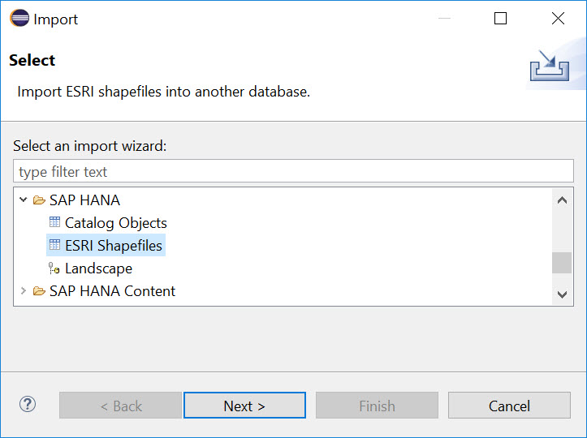
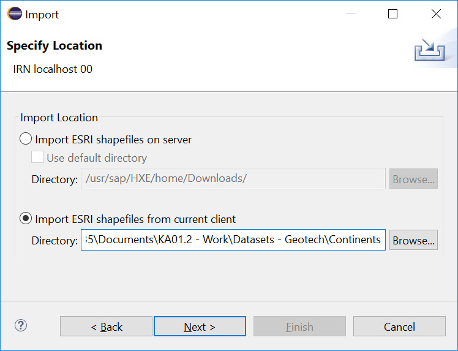
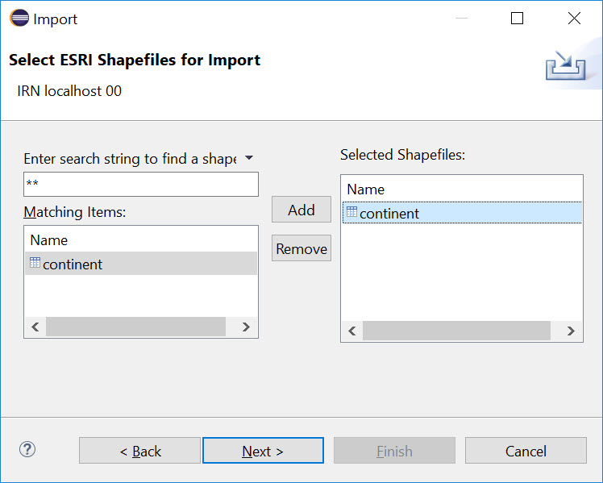
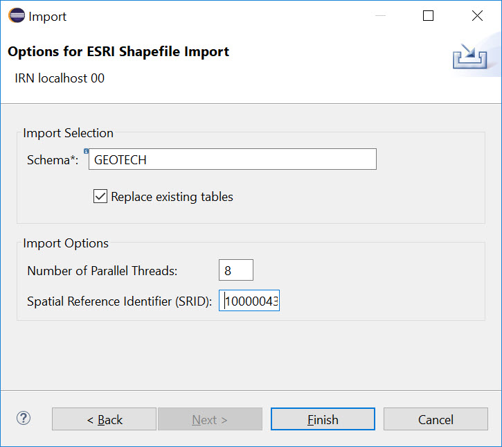

## Prerequisites  
 - Eclipse is setup for CodeJam exercises

## Details
### You will learn  
  - How to load ESRI shape files into SAP HANA using Eclipse

Add additional information: Background information, longer prerequisites

---

[ACCORDION-BEGIN [Step 1: ](Download Geotech files)]

Download two zip files from [http://bit.ly/GeotechFiles](http://bit.ly/GeotechFiles) to your computer.

Uncompress them.


[ACCORDION-END]

[ACCORDION-BEGIN [Step 2: ](View file content with Mapshaper)]

Open [`Mapshaper`](https://mapshaper.org/) web site and load `Continents.zip` file to check the content.


[ACCORDION-END]


[ACCORDION-BEGIN [Step 3: ](Create a schema to load files)]

Create a schema `GEOTECH` using SQL.

```sql
CREATE SCHEMA "GEOTECH";
```


[ACCORDION-END]

[ACCORDION-BEGIN [Step 4: ](Load files via Eclipse)]

In Eclipse in SAP HANA Administration go to **File** -> **Import**.

Select an import wizard for **SAP HANA** -> **ESRI Shapefiles**. Click **Next**



Select you SAP HANA instance as a target, if asked by the wizard.

In **Specify Location** screen select the option to load from current client (i.e. from your laptop).

Click **Browse** and point to the directory `Continets`, where you uncompressed the zip file.



On **Select ESRI Shapefiles to import** you should see `continent` has been found in the directory and added to **Selected Shapefiles**.



On **Options...** screen type:
- Schema: `GEOTECH`
- Replace existing tables: checked
- Number of parallel threads: `4`
- Spatial Reference Identifier: `1000004326`



Click **Finish**


[ACCORDION-END]

[ACCORDION-BEGIN [Step 5: ](Verify loaded data)]

Check there are 8 records loaded using SQL:

```sql
SELECT COUNT(*) FROM "GEOTECH"."continent";
```


[ACCORDION-END]

[ACCORDION-BEGIN [Step 6: ](Load countries file)]

Repeat the same steps to load `cntry00` data into `"GEOTECH"` schema as well.


[ACCORDION-END]


---
