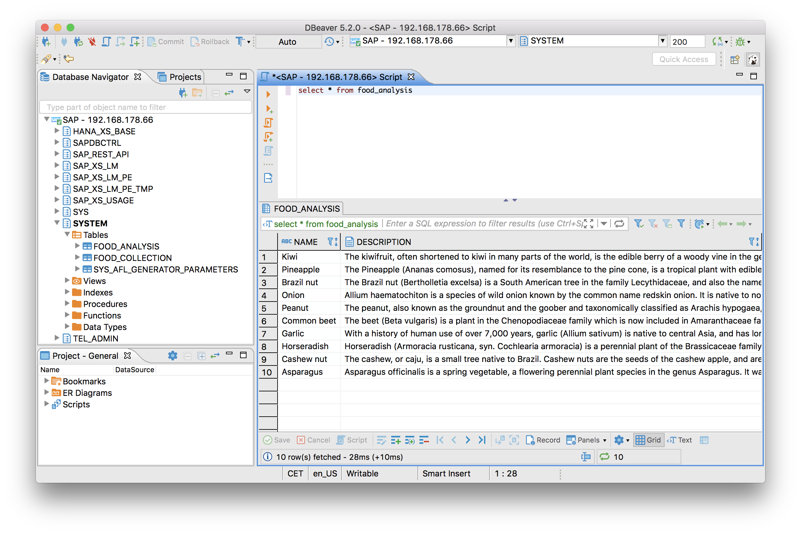
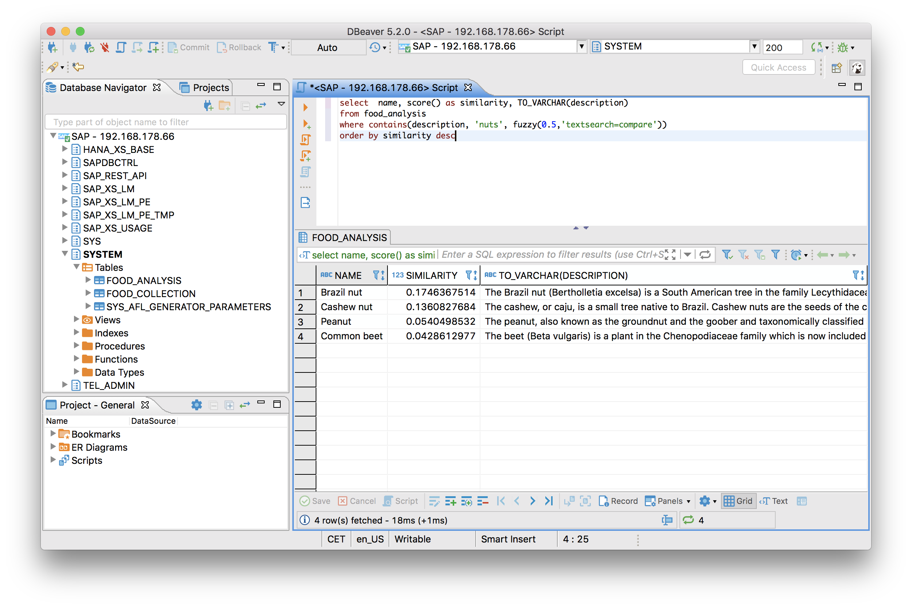
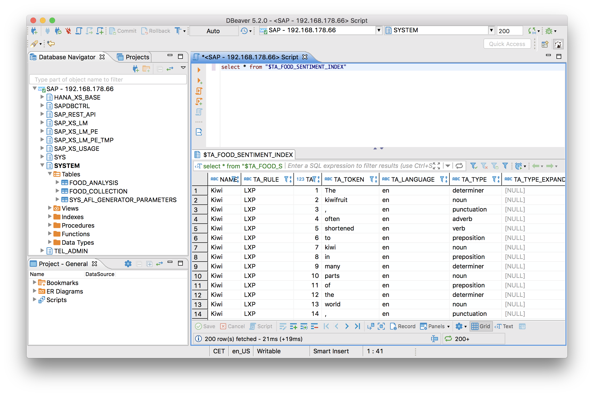
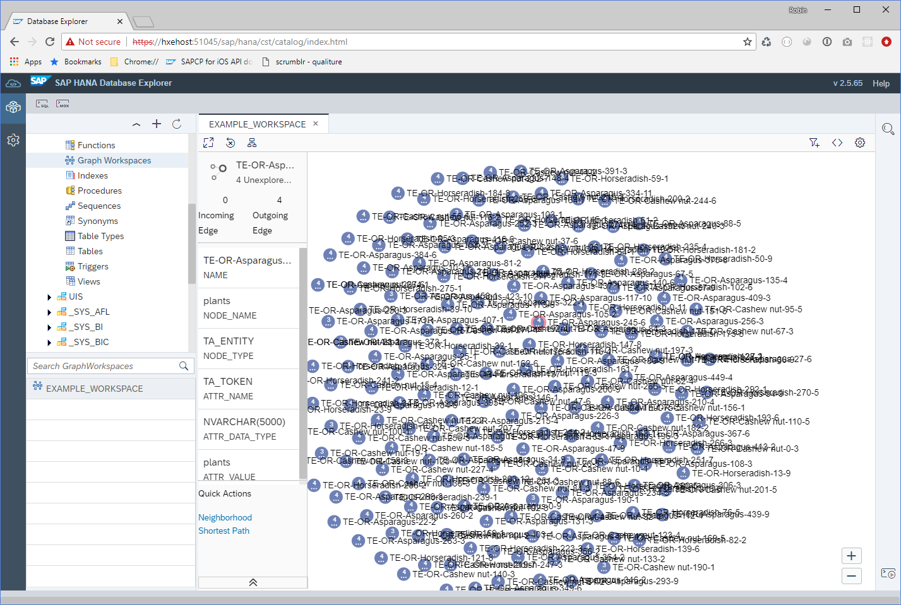
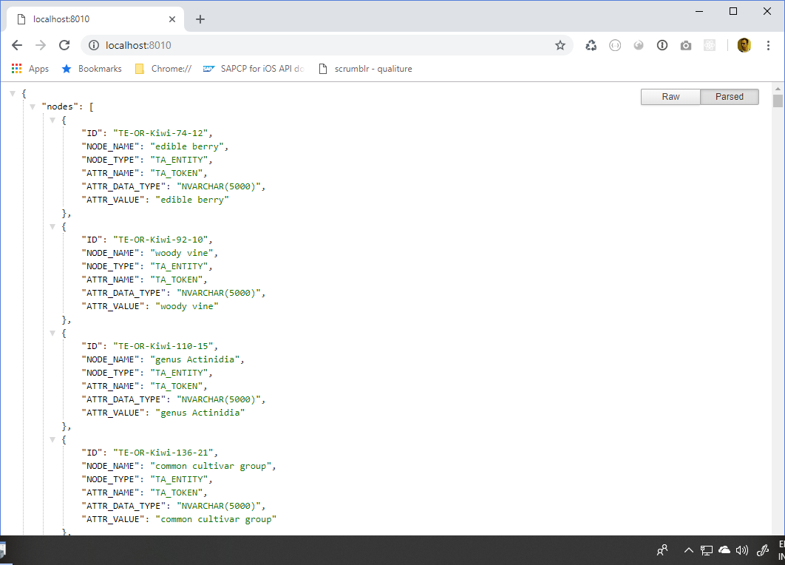
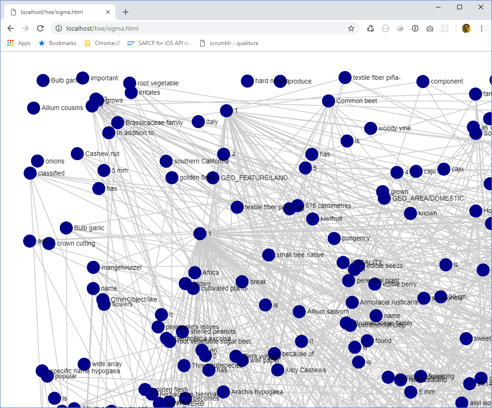

## Prerequisites  
 - SAP HANA Express Edition 2.0 installed
 - SQL editor installed (`Jupyter`, `SQLPad`, `DBeaver`, etc)

## Details
### You will learn  
  In this tutorial series, you will learn to perform some basic Text Analysis on the food data, and modify the Node.js app to perform a fuzzy search.

---

[ACCORDION-BEGIN [Step 1: ](Create table for fuzzy search)]

In order to perform Text Analysis on the JSON documents, you need to copy the data to a columnar table, and enable fuzzy text search on its index.

First, you need to create the table.

Perform the following SQL statement:

```sql
create column table food_analysis
(
	name nvarchar(64),
	description text FAST PREPROCESS ON FUZZY SEARCH INDEX ON
);
```

This statement will create a table `food_analysis` with two fields; a field `name` for the name of the food, and a field `description` which will have fuzzy text search enabled.


[DONE]
[ACCORDION-END]

[ACCORDION-BEGIN [Step 2: ](Copy from Document Store to Table)]

In the previous step you created a columnar table. In this step, you will populate it with the `name` and `description` fields from the JSON documents in the Document Store.

Perform the following SQL statement:

```sql
insert into food_analysis
with doc_store as (select "name", "description" from food_collection)
select doc_store."name" as name, doc_store."description" as description
from doc_store;
```

This statement will insert into table `food_analysis` the data from fields `name` and `description` which come from the `food_collection` collection in the Document Store.

To check whether the data has been copied properly, execute the statement `select * from food_analysis` and see if the name and description fields are properly filled:



[DONE]
[ACCORDION-END]


[ACCORDION-BEGIN [Step 3: ](Perform some Text Analysis queries)]

With the data enabled for Text Analysis, you can now try out some queries.

Perform the following query:

```sql
select  name, score() as similarity, TO_VARCHAR(description)
from food_analysis
where contains(description, 'nuts', fuzzy(0.5,'textsearch=compare'))
order by similarity desc
```

You will see a result similar to this:



If you look at the actual texts in the `description` field, you may notice some may contain the word `nuts`, but others won't.

Another surprising result may be the appearance of the `Common beet` entry. However, if you look into its description, it is said that:

> `[...] The fruit is a cluster of hard nutlets.`

...so ultimately it makes sense for the common beet to show up after all.

In this example, the option `textSearch` does a full-text search. [There are many more options available for fuzzy text search](https://help.sap.com/viewer/691cb949c1034198800afde3e5be6570/2.0.01/en-US/ce619608bb5710148a42ebb92208b5cd.html), such as `similarCalculationMode` which controls how the similarity of two strings are calculated.

Try the following query:

```sql
select  name, score() as similarity, TO_VARCHAR(description)
from food_analysis
where contains(description, 'europe', fuzzy(0.7,'similarCalculationMode=symmetricsearch'))
order by similarity desc
```

This will return all foods in Europe with the best matching results and a fault tolerance of 0.7

[DONE]
[ACCORDION-END]

[ACCORDION-BEGIN [Step 4: ](Perform Linguistic Text Analysis)]

In the previous example, you performed a couple of queries using fuzzy search. It is also possible to perform linguistic analysis.

Since you cannot have two indices on the same single column, let's create a new table:

```sql
create column table food_sentiment
(
	name nvarchar(64) primary key,
	description nvarchar(2048)
);
```

Similar to the other columnar table, you need to import the JSON documents again:

```sql
insert into food_sentiment
with doc_store as (select "name", "description" from food_collection)
select doc_store."name" as name, doc_store."description" as description
from doc_store;
```

Now, you create a new index with full text analysis capabilities on the `description` column:

```sql
CREATE FULLTEXT INDEX FOOD_SENTIMENT_INDEX ON "FOOD_SENTIMENT" ("DESCRIPTION")
CONFIGURATION 'GRAMMATICAL_ROLE_ANALYSIS'
LANGUAGE DETECTION ('EN')
SEARCH ONLY OFF
FAST PREPROCESS OFF
TEXT MINING OFF
TOKEN SEPARATORS ''
TEXT ANALYSIS ON;
```

This will create the index `FOOD_SENTIMENT_INDEX`, but it will also create a Text Analysis table `$TA_FOOD_SENTIMENT_INDEX`.

If you query that table with:

```sql
select * from "$TA_FOOD_SENTIMENT_INDEX"
```

...you get a full breakdown of each word, its type, its normalized form and stem, if applicable:



[DONE]
[ACCORDION-END]

[ACCORDION-BEGIN [Step 5: ](Generate data for Graph nodes)]

The `$TA` table you created in the previous step could already give some text analysis insights, but due to the flat structure, it's use case is fairly limited. The "Graph" model is much more versatile, since it requires two tables (or views); one for the data of the nodes and vertices, and one for the edges. In the following steps, you will create these two views, create a Graph workspace, and display its data.

To create the nodes table, execute the following statement:

```sql
CREATE VIEW "NODES_DATA" AS
 (
       SELECT * FROM
       (
             (     -- Nodes representing each TA_ENTITY in a document
                   SELECT
                         'TE-OR-'||TO_NVARCHAR("NAME")||'-'||TO_NVARCHAR("TA_OFFSET")||'-'||LENGTH("TA_TOKEN") ID,
                         TO_NVARCHAR("TA_TOKEN") NODE_NAME,
                         'TA_ENTITY' NODE_TYPE,
                         'TA_TOKEN' ATTR_NAME,
                         'NVARCHAR(5000)' ATTR_DATA_TYPE,
                         TO_NVARCHAR("TA_TOKEN") ATTR_VALUE
                   FROM "$TA_FOOD_SENTIMENT_INDEX"
                   WHERE "TA_TOKEN" IS NOT NULL
                   GROUP BY "NAME","TA_OFFSET","TA_TOKEN"
             )
             UNION
             (     -- Nodes representing each TA_OFFSET attribute of each TA_ENTITY
                   SELECT
                         'TE-M1-'||TO_NVARCHAR("NAME")||'-'||TO_NVARCHAR("TA_OFFSET")||'-'||LENGTH("TA_TOKEN") ID,
                         TO_NVARCHAR("TA_TOKEN") NODE_NAME,
                         'TA_ENTITY_M1' NODE_TYPE,
                         'TA_OFFSET' ATTR_NAME,
                         'BIGINT' ATTR_DATA_TYPE,
                         TO_NVARCHAR("TA_OFFSET") ATTR_VALUE
                   FROM "$TA_FOOD_SENTIMENT_INDEX"
                   WHERE "TA_TOKEN" IS NOT NULL
                   GROUP BY "NAME","TA_OFFSET","TA_TOKEN"
             )
             UNION
             (     -- Nodes representing each extracted TA_TYPE
                   SELECT
                         'TT-OR-'||TO_NVARCHAR("TA_TYPE") ID,
                         TO_NVARCHAR("TA_TYPE") NODE_NAME,
                         'TA_TYPE' NODE_TYPE,
                         'TA_TYPE' ATTR_NAME,
                         'NVARCHAR(100)' ATTR_DATA_TYPE,
                         TO_NVARCHAR("TA_TYPE") ATTR_VALUE
                   FROM "$TA_FOOD_SENTIMENT_INDEX"
                   WHERE "TA_TYPE" IS NOT NULL
                               AND "TA_TYPE" NOT LIKE 'MWT_%'
                               AND "TA_TYPE_EXPANDED" IS NULL
                   GROUP BY "TA_TYPE"
             )
             UNION
             (     -- Nodes representing each extracted POS types
                   SELECT
                         'TP-OR-'||(CASE WHEN "TA_TYPE" LIKE 'MWT_%' THEN TO_NVARCHAR("TA_TYPE") ELSE TO_NVARCHAR("TA_TYPE_EXPANDED") END) ID,
                         CASE WHEN "TA_TYPE" LIKE 'MWT_%' THEN TO_NVARCHAR("TA_TYPE") ELSE TO_NVARCHAR("TA_TYPE_EXPANDED") END NODE_NAME,
                         'TA_POS' NODE_TYPE,
                         'TA_TYPE_EXPANDED' ATTR_NAME,
                         'NVARCHAR(100)' ATTR_DATA_TYPE,
                         TO_NVARCHAR("TA_TYPE_EXPANDED") ATTR_VALUE
                   FROM "$TA_FOOD_SENTIMENT_INDEX"
                   WHERE "TA_TYPE_EXPANDED" IS NOT NULL OR "TA_TYPE" LIKE 'MWT_%'
                   GROUP BY "TA_TYPE","TA_TYPE_EXPANDED"
             )
             UNION
             (     -- Nodes representing each extracted TA_NORMALIZED form
                   SELECT
                         'TN-OR-'||TO_NVARCHAR("TA_NORMALIZED") ID,
                         TO_NVARCHAR("TA_NORMALIZED") NODE_NAME,
                         'TA_NORMALIZED' NODE_TYPE,
                         'TA_NORMALIZED' ATTR_NAME,
                         'NVARCHAR(5000)' ATTR_DATA_TYPE,
                         TO_NVARCHAR("TA_NORMALIZED") ATTR_VALUE
                   FROM "$TA_FOOD_SENTIMENT_INDEX"
                   WHERE "TA_TYPE" NOT IN ('DATE','STOPWORD')
                               AND "TA_RULE" <> 'LXP'
                               AND "TA_TYPE" NOT LIKE 'MWT_%'
                               AND "TA_NORMALIZED" IS NOT NULL
                   GROUP BY "TA_NORMALIZED"
             )
             UNION
             (     -- Nodes representing each extracted TA_STEM
                   SELECT
                         'TS-OR-'||TO_NVARCHAR(COALESCE("TA_STEM","TA_NORMALIZED")) ID,
                         TO_NVARCHAR(COALESCE("TA_STEM","TA_NORMALIZED")) NODE_NAME,
                         'TA_STEM' NODE_TYPE,
                         'TA_STEM' ATTR_NAME,
                         'NVARCHAR(5000)' ATTR_DATA_TYPE,
                         TO_NVARCHAR(COALESCE("TA_STEM","TA_NORMALIZED")) ATTR_VALUE
                   FROM "$TA_FOOD_SENTIMENT_INDEX"
                   WHERE "TA_RULE" = 'LXP' AND COALESCE("TA_STEM","TA_NORMALIZED") IS NOT NULL
                   GROUP BY COALESCE("TA_STEM","TA_NORMALIZED")
             )
             UNION
             (     -- Nodes representing each normalized (and post-processed) DATE
                   SELECT
                         'DT-OR-'||REPLACE(TO_NVARCHAR("TA_NORMALIZED"),' ','_') ID,
                         TO_NVARCHAR("TA_NORMALIZED") NODE_NAME,
                         'DATE' NODE_TYPE,
                         'TA_NORMALIZED' ATTR_NAME,
                         'NVARCHAR(5000)' ATTR_DATA_TYPE,
                         TO_NVARCHAR("TA_NORMALIZED") ATTR_VALUE
                   FROM "$TA_FOOD_SENTIMENT_INDEX"
                   WHERE "TA_TYPE" = 'DATE'
                               AND "TA_NORMALIZED" IS NOT NULL
                   GROUP BY "TA_NORMALIZED"
             )
             UNION
             (     -- Nodes representing each processed DOCUMENT
                   SELECT
                         'DO-OR-'||TO_NVARCHAR("NAME") ID,
                         TO_NVARCHAR("NAME") NODE_NAME,
                         'DOCUMENT' NODE_TYPE,
                         'NAME' ATTR_NAME,
                         'INTEGER' ATTR_DATA_TYPE,
                         TO_NVARCHAR("NAME") ATTR_VALUE
                   FROM "$TA_FOOD_SENTIMENT_INDEX"
                   WHERE "NAME" IS NOT NULL
                   GROUP BY "NAME"
             )
             UNION
             (     -- Nodes representing each processed PARAGRAPH in a document
                   SELECT
                         'PG-OR-'||TO_NVARCHAR("NAME")||'-'||TO_NVARCHAR("TA_PARAGRAPH") ID,
                         TO_NVARCHAR("TA_PARAGRAPH") NODE_NAME,
                         'PARAGRAPH' NODE_TYPE,
                         'TA_PARAGRAPH' ATTR_NAME,
                         'INTEGER' ATTR_DATA_TYPE,
                         TO_NVARCHAR("TA_PARAGRAPH") ATTR_VALUE
                   FROM "$TA_FOOD_SENTIMENT_INDEX"
                   WHERE "TA_PARAGRAPH" IS NOT NULL
                   GROUP BY "NAME", "TA_PARAGRAPH"
             )
             UNION
             (     -- Nodes representing each processed SENTENCE in a document
                   SELECT
                         'ST-OR-'||TO_NVARCHAR("NAME")||'-'||TO_NVARCHAR("TA_SENTENCE") ID,
                         TO_NVARCHAR("TA_SENTENCE") NODE_NAME,
                         'SENTENCE' NODE_TYPE,
                         'TA_SENTENCE' ATTR_NAME,
                         'INTEGER' ATTR_DATA_TYPE,
                         TO_NVARCHAR("TA_SENTENCE") ATTR_VALUE
                   FROM "$TA_FOOD_SENTIMENT_INDEX"
                   WHERE "TA_SENTENCE" IS NOT NULL
                   GROUP BY "NAME", "TA_SENTENCE"
             )
             UNION
             (     -- Nodes representing each processed LANGUAGE
                   SELECT
                         'LG-OR-'||TO_NVARCHAR("TA_LANGUAGE") ID,
                         TO_NVARCHAR("TA_LANGUAGE") NODE_NAME,
                         'LANGUAGE' NODE_TYPE,
                         'TA_LANGUAGE' ATTR_NAME,
                         'INTEGER' ATTR_DATA_TYPE,
                         TO_NVARCHAR("TA_LANGUAGE") ATTR_VALUE
                   FROM "$TA_FOOD_SENTIMENT_INDEX"
                   WHERE "TA_LANGUAGE" IS NOT NULL
                   GROUP BY "TA_LANGUAGE"
             )
       )
 );
```

[DONE]
[ACCORDION-END]

[ACCORDION-BEGIN [Step 6: ](Generate data for Graph edges)]

To create the edges table, execute the following statement:

```sql
CREATE VIEW  "EDGES_DATA" AS
(
      SELECT * FROM
      (
            (
                  SELECT
                        'TE-OR-'||TO_NVARCHAR("NAME")||'-'||TO_NVARCHAR("TA_OFFSET")||'-'||LENGTH("TA_TOKEN")||'-'||'PG-OR-'||TO_NVARCHAR("NAME")||'-'||TO_NVARCHAR("TA_PARAGRAPH") ID,
                        'TE-OR-'||TO_NVARCHAR("NAME")||'-'||TO_NVARCHAR("TA_OFFSET")||'-'||LENGTH("TA_TOKEN") src_id,
                        'PG-OR-'||TO_NVARCHAR("NAME")||'-'||TO_NVARCHAR("TA_PARAGRAPH") dest_id,
                        'TE-PG' EDGE_TYPE,
                        0 "DISTANCE"
                  FROM  "$TA_FOOD_SENTIMENT_INDEX"
                  GROUP BY "NAME","TA_OFFSET","TA_TOKEN","TA_PARAGRAPH"
            )
            UNION
            (
                  SELECT
                        'TE-OR-'||TO_NVARCHAR("NAME")||'-'||TO_NVARCHAR("TA_OFFSET")||'-'||LENGTH("TA_TOKEN")||'-'||'ST-OR-'||TO_NVARCHAR("NAME")||'-'||TO_NVARCHAR("TA_SENTENCE") ID,
                        'TE-OR-'||TO_NVARCHAR("NAME")||'-'||TO_NVARCHAR("TA_OFFSET")||'-'||LENGTH("TA_TOKEN") src_id,
                        'ST-OR-'||TO_NVARCHAR("NAME")||'-'||TO_NVARCHAR("TA_SENTENCE") dest_id,
                        'TE-ST' EDGE_TYPE,
                        0 "DISTANCE"
                  FROM  "$TA_FOOD_SENTIMENT_INDEX"
                  GROUP BY "NAME","TA_OFFSET","TA_TOKEN","TA_SENTENCE"
            )
            UNION
            (
                  SELECT
                        'TE-OR-'||TO_NVARCHAR("NAME")||'-'||TO_NVARCHAR("TA_OFFSET")||'-'||LENGTH("TA_TOKEN")||'-'||'TS-OR-'||TO_NVARCHAR(COALESCE("TA_STEM","TA_NORMALIZED")) ID,
                        'TE-OR-'||TO_NVARCHAR("NAME")||'-'||TO_NVARCHAR("TA_OFFSET")||'-'||LENGTH("TA_TOKEN") src_id,
                        'TS-OR-'||TO_NVARCHAR(COALESCE("TA_STEM","TA_NORMALIZED")) dest_id,
                        'TE-TS' EDGE_TYPE,
                        0 "DISTANCE"
                  FROM  "$TA_FOOD_SENTIMENT_INDEX"
                  WHERE "TA_RULE" = 'LXP' AND COALESCE("TA_STEM","TA_NORMALIZED") IS NOT NULL
                  GROUP BY "NAME","TA_OFFSET","TA_TOKEN",COALESCE("TA_STEM","TA_NORMALIZED")
            )
            UNION
            (
                  SELECT
                        'TE-OR-'||TO_NVARCHAR("NAME")||'-'||TO_NVARCHAR("TA_OFFSET")||'-'||LENGTH("TA_TOKEN")||'-'||'TP-OR-'||(CASE WHEN "TA_TYPE" LIKE 'MWT_%' THEN TO_NVARCHAR("TA_TYPE") ELSE TO_NVARCHAR("TA_TYPE_EXPANDED") END) ID,
                        'TE-OR-'||TO_NVARCHAR("NAME")||'-'||TO_NVARCHAR("TA_OFFSET")||'-'||LENGTH("TA_TOKEN") src_id,
                        'TP-OR-'||(CASE WHEN "TA_TYPE" LIKE 'MWT_%' THEN TO_NVARCHAR("TA_TYPE") ELSE TO_NVARCHAR("TA_TYPE_EXPANDED") END) dest_id,
                        'TE-TP' EDGE_TYPE,
                        0 "DISTANCE"
                  FROM  "$TA_FOOD_SENTIMENT_INDEX"
                  WHERE "TA_TYPE_EXPANDED" IS NOT NULL OR "TA_TYPE" LIKE 'MWT_%'
                  GROUP BY "NAME","TA_OFFSET","TA_TOKEN","TA_TYPE","TA_TYPE_EXPANDED"
            )
            UNION
            (
                  SELECT
                        'TE-OR-'||TO_NVARCHAR("NAME")||'-'||TO_NVARCHAR("TA_OFFSET")||'-'||LENGTH("TA_TOKEN")||'-'||'DT-OR-'||REPLACE(TO_NVARCHAR("TA_NORMALIZED"),' ','_') ID,
                        'TE-OR-'||TO_NVARCHAR("NAME")||'-'||TO_NVARCHAR("TA_OFFSET")||'-'||LENGTH("TA_TOKEN") src_id,
                        'DT-OR-'||REPLACE(TO_NVARCHAR("TA_NORMALIZED"),' ','_') dest_id,
                        'TE-DT' EDGE_TYPE,
                        0 "DISTANCE"
                  FROM  "$TA_FOOD_SENTIMENT_INDEX"
                  WHERE "TA_TYPE" = 'DATE'
                              AND "TA_NORMALIZED" IS NOT NULL
                  GROUP BY "NAME","TA_OFFSET","TA_TOKEN","TA_NORMALIZED"
            )
            UNION
            (
                  SELECT
                        'TE-OR-'||TO_NVARCHAR("NAME")||'-'||TO_NVARCHAR("TA_OFFSET")||'-'||LENGTH("TA_TOKEN")||'-'||'TN-OR-'||TO_NVARCHAR("TA_NORMALIZED") ID,
                        'TE-OR-'||TO_NVARCHAR("NAME")||'-'||TO_NVARCHAR("TA_OFFSET")||'-'||LENGTH("TA_TOKEN") src_id,
                        'TN-OR-'||TO_NVARCHAR("TA_NORMALIZED") dest_id,
                        'TE-TN' EDGE_TYPE,
                        0 "DISTANCE"
                  FROM  "$TA_FOOD_SENTIMENT_INDEX"
                  WHERE "TA_TYPE" NOT IN ('DATE','STOPWORD')
                              AND "TA_RULE" <> 'LXP'
                              AND "TA_TYPE" NOT LIKE 'MWT_%'
                              AND "TA_NORMALIZED" IS NOT NULL
                  GROUP BY "NAME","TA_OFFSET","TA_TOKEN","TA_NORMALIZED"
            )
            UNION
            (
                  SELECT
                        'ST-OR-'||TO_NVARCHAR("NAME")||'-'||TO_NVARCHAR("TA_SENTENCE")||'-'||'PG-OR-'||TO_NVARCHAR("NAME")||'-'||TO_NVARCHAR("TA_PARAGRAPH") ID,
                        'ST-OR-'||TO_NVARCHAR("NAME")||'-'||TO_NVARCHAR("TA_SENTENCE") src_id,
                        'PG-OR-'||TO_NVARCHAR("NAME")||'-'||TO_NVARCHAR("TA_PARAGRAPH") dest_id,
                        'ST-PG' EDGE_TYPE,
                        1 "DISTANCE"
                  FROM  "$TA_FOOD_SENTIMENT_INDEX"
                  GROUP BY "NAME", "TA_SENTENCE", "TA_PARAGRAPH"
            )
            UNION
            (
                  SELECT
                        'PG-OR-'||TO_NVARCHAR("NAME")||'-'||TO_NVARCHAR("TA_PARAGRAPH")||'-'||'DO-OR-'||TO_NVARCHAR("NAME") ID,
                        'PG-OR-'||TO_NVARCHAR("NAME")||'-'||TO_NVARCHAR("TA_PARAGRAPH") src_id,
                        'DO-OR-'||TO_NVARCHAR("NAME") dest_id,
                        'PG-DO' EDGE_TYPE,
                        1 "DISTANCE"
                  FROM  "$TA_FOOD_SENTIMENT_INDEX"
                  GROUP BY "NAME", "TA_PARAGRAPH"
            )
            UNION
            (
                  SELECT
                        'ST-OR-'||TO_NVARCHAR("NAME")||'-'||TO_NVARCHAR("TA_SENTENCE")||'-'||'DO-OR-'||TO_NVARCHAR("NAME") ID,
                        'ST-OR-'||TO_NVARCHAR("NAME")||'-'||TO_NVARCHAR("TA_SENTENCE") src_id,
                        'DO-OR-'||TO_NVARCHAR("NAME") dest_id,
                        'ST-DO' EDGE_TYPE,
                        0 "DISTANCE"
                  FROM  "$TA_FOOD_SENTIMENT_INDEX"
                  GROUP BY "NAME", "TA_SENTENCE"
            )
            UNION
            (
                  SELECT
                        'DO-OR-'||TO_NVARCHAR("NAME")||'-'||'LG-OR-'||TO_NVARCHAR("TA_LANGUAGE") ID,
                        'DO-OR-'||TO_NVARCHAR("NAME") src_id,
                        'LG-OR-'||TO_NVARCHAR("TA_LANGUAGE") dest_id,
                        'DO-LG' EDGE_TYPE,
                        0 "DISTANCE"
                  FROM  "$TA_FOOD_SENTIMENT_INDEX"
                  GROUP BY "NAME", "TA_LANGUAGE"
            )
            UNION
            (
                  SELECT
                        'TE-OR-'||TO_NVARCHAR("NAME")||'-'||TO_NVARCHAR("TA_OFFSET")||'-'||LENGTH("TA_TOKEN")||'-'||'TT-OR-'||TO_NVARCHAR("TA_TYPE") ID,
                        'TE-OR-'||TO_NVARCHAR("NAME")||'-'||TO_NVARCHAR("TA_OFFSET")||'-'||LENGTH("TA_TOKEN") src_id,
                        'TT-OR-'||TO_NVARCHAR("TA_TYPE") dest_id,
                        'TE-TT' EDGE_TYPE,
                        0 "DISTANCE"
                  FROM  "$TA_FOOD_SENTIMENT_INDEX"
                  WHERE "TA_TYPE" IS NOT NULL
                        AND "TA_TYPE" NOT LIKE 'MWT_%'
                        AND "TA_TYPE_EXPANDED" IS NULL
                  GROUP BY "NAME","TA_OFFSET","TA_TOKEN","TA_TYPE"
            )
            UNION
            (
                  SELECT
                        'TE-OR-'||TO_NVARCHAR(B."NAME")||'-'||TO_NVARCHAR(B."TA_OFFSET")||'-'||LENGTH(B."TA_TOKEN")||'-constitutes-'||'TE-OR-'||TO_NVARCHAR(A."NAME")||'-'||TO_NVARCHAR(A."TA_OFFSET")||'-'||LENGTH(A."TA_TOKEN") ID,
                        'TE-OR-'||TO_NVARCHAR(B."NAME")||'-'||TO_NVARCHAR(B."TA_OFFSET")||'-'||LENGTH(B."TA_TOKEN") src_id,
                        'TE-OR-'||TO_NVARCHAR(A."NAME")||'-'||TO_NVARCHAR(A."TA_OFFSET")||'-'||LENGTH(A."TA_TOKEN") dest_id,
                        'constitutes' EDGE_TYPE,
                        0 "DISTANCE"
                  FROM
                         "$TA_FOOD_SENTIMENT_INDEX" A
                        LEFT JOIN
                         "$TA_FOOD_SENTIMENT_INDEX" B
                        ON    A."NAME" = B."NAME"
                              AND (A."NAME",A."TA_OFFSET",LENGTH(A."TA_TOKEN")) <> (B."NAME",B."TA_OFFSET",LENGTH(B."TA_TOKEN"))
                              AND A."TA_OFFSET" <= B."TA_OFFSET"
                              AND A."TA_OFFSET" + LENGTH(A."TA_TOKEN") >= B."TA_OFFSET" + LENGTH(B."TA_TOKEN")
                  WHERE B."NAME" IS NOT NULL
                  GROUP BY B."NAME",B."TA_OFFSET",B."TA_TOKEN",A."NAME",A."TA_OFFSET",A."TA_TOKEN"
            )
            UNION
            (
                  SELECT
                        'TE-OR-'||TO_NVARCHAR("CHILD"."NAME")||'-'||TO_NVARCHAR("CHILD"."TA_OFFSET")||'-'||LENGTH("CHILD"."TA_TOKEN") || '-is_SubEntity_of-' || 'TE-OR-'||TO_NVARCHAR("PARENT"."NAME")||'-'||TO_NVARCHAR("PARENT"."TA_OFFSET")||'-'||LENGTH("PARENT"."TA_TOKEN") ID,
                        'TE-OR-'||TO_NVARCHAR("CHILD"."NAME")||'-'||TO_NVARCHAR("CHILD"."TA_OFFSET")||'-'||LENGTH("CHILD"."TA_TOKEN") src_id,
                        'TE-OR-'||TO_NVARCHAR("PARENT"."NAME")||'-'||TO_NVARCHAR("PARENT"."TA_OFFSET")||'-'||LENGTH("PARENT"."TA_TOKEN") dest_id,
                        'is_SubEntity_of' edge_type,
                        1 "DISTANCE"
                  FROM
                         "$TA_FOOD_SENTIMENT_INDEX"
                        "CHILD"
                        INNER JOIN
                         "$TA_FOOD_SENTIMENT_INDEX"
                        "PARENT"
                        ON "PARENT"."NAME" = "CHILD"."NAME"
                        AND "PARENT"."TA_RULE" = "CHILD"."TA_RULE"
                        AND "PARENT"."TA_COUNTER" = "CHILD"."TA_PARENT"
                        AND "CHILD"."TA_RULE" <> 'Grammatical Role'
            )
            UNION
            (
                  SELECT
                        'TE-OR-'||TO_NVARCHAR("CHILD"."NAME")||'-'||TO_NVARCHAR("CHILD"."TA_OFFSET")||'-'||LENGTH("CHILD"."TA_TOKEN") || '-is_' || "CHILD"."TA_TYPE" || '_of-' || 'TE-OR-'||TO_NVARCHAR("PARENT"."NAME")||'-'||TO_NVARCHAR("PARENT"."TA_OFFSET")||'-'||LENGTH("PARENT"."TA_TOKEN") ID,
                        'TE-OR-'||TO_NVARCHAR("CHILD"."NAME")||'-'||TO_NVARCHAR("CHILD"."TA_OFFSET")||'-'||LENGTH("CHILD"."TA_TOKEN") src_id,
                        'TE-OR-'||TO_NVARCHAR("PARENT"."NAME")||'-'||TO_NVARCHAR("PARENT"."TA_OFFSET")||'-'||LENGTH("PARENT"."TA_TOKEN") dest_id,
                        'is_' || "CHILD"."TA_TYPE" || '_of' edge_type,
                        1 "DISTANCE"
                  FROM
                         "$TA_FOOD_SENTIMENT_INDEX"
                        "CHILD"
                        INNER JOIN
                         "$TA_FOOD_SENTIMENT_INDEX"
                        "PARENT"
                        ON "PARENT"."NAME" = "CHILD"."NAME"
                        AND "PARENT"."TA_RULE" = "CHILD"."TA_RULE"
                        AND "PARENT"."TA_COUNTER" = "CHILD"."TA_PARENT"
                        AND "CHILD"."TA_RULE" = 'Grammatical Role'
            )
      )
);
```

[DONE]
[ACCORDION-END]

[ACCORDION-BEGIN [Step 7: ](Create Graph Workspace)]

Although you can directly use the two views in the Graph workspace, copying the view results into dedicated tables performs much faster. Also, the Graph Viewer only supports direct table access.

First, create the `NODES` table and populate it with the `NODES_DATA` view result:

```sql
CREATE COLUMN TABLE "NODES" (
       "ID" NVARCHAR(5000) PRIMARY KEY, -- REQUIRED PRIMARY KEY FIELD FOR GRAPH ENGINE
       "NODE_NAME" NVARCHAR(5000),
       "NODE_TYPE" NVARCHAR(100),
       "ATTR_NAME" NVARCHAR(100),
       "ATTR_DATA_TYPE" NVARCHAR(100),
       "ATTR_VALUE" NVARCHAR(5000)
);     

SELECT * FROM NODES_DATA INTO NODES;
```

Then, create the `EDGES` table and populate it with the `EDGES_DATA` view result:

```sql
CREATE COLUMN TABLE "EDGES" (
       "ID" NVARCHAR(5000) UNIQUE NOT NULL, -- REQUIRED UNIQUE FIELD FOR GRAPH ENGINE
       "SRC_ID" NVARCHAR(5000) NOT NULL REFERENCES "NODES" ("ID") ON UPDATE CASCADE ON DELETE CASCADE, -- REQUIRED FOREIGN KEY FIELD FOR GRAPH ENGINE
       "DEST_ID" NVARCHAR(5000) NOT NULL REFERENCES "NODES" ("ID") ON UPDATE CASCADE ON DELETE CASCADE, -- REQUIRED FOREIGN KEY FIELD FOR GRAPH ENGINE
       "EDGE_TYPE" NVARCHAR(100),
       "DISTANCE" INTEGER
);

SELECT * FROM EDGES_DATA INTO EDGES;
```

Now, create a Graph workspace:

```sql
  CREATE GRAPH WORKSPACE  "EXAMPLE_WORKSPACE"
  EDGE TABLE  "EDGES_DATA"
  SOURCE COLUMN "src_id"
  TARGET COLUMN "dest_id"
  KEY COLUMN "NAME"
  VERTEX TABLE  "NODES_DATA"
  KEY COLUMN "NAME";
```

[DONE]
[ACCORDION-END]

[ACCORDION-BEGIN [Step 8: ](Display the results using Graph Viewer)]

> **This step requires SAP HANA Express Edition with XSA service**

> If you have installed the non XSA version, you may skip this step and continue with **Step 9**

The two Graph tables are now created, populated with the contents from the `$TA` table. The Graph workspace can now be visualized using the Graph Visualizer in your SAP HANA Database Explorer:



[VALIDATE_8]
[ACCORDION-END]

[ACCORDION-BEGIN [Step 9: ](Display the results using Sigma)]

In step 8, you could visualize the Graph Workspace using the Graph Viewer in SAP HANA Database Tools. A more useful case is to utilize a 3rd party Graph library and incorporate this in an application. In the final step of this tutorial, you will visualize the text analysis data using [Sigma](http://sigmajs.org/), a widely used Graph library.

For simplicity of the tutorial, the data of the `NODES` and `EDGES` table will be combined in a REST service served by Node.js

A separate HTML page will call that REST service and feed its contents to the Sigma library which will then be plotted into the HTML file.

[DONE]
[ACCORDION-END]

[ACCORDION-BEGIN [Step 10: ](Create the nodejs REST service)]

In the folder you previously created the Node.js `index.js` application, create a new file `graph.js`.

Add the following content:

```javascript
const http = require("http");

const hanaClient = require("@sap/hana-client");

const connection = hanaClient.createConnection();

const connectionParams = {
    host : "hxehost",
    port : 39013,
    uid  : "SYSTEM",
    pwd  : "A5h3eKSf.1",
    databaseName : "HXE"
}

http.createServer(function(request, response) {
    connection.connect(connectionParams, (err) => {
        if (err) {
            return console.error("Connection error", err);
        }

        const sqlEdges = "SELECT * FROM EDGES";
        const sqlNodes = "SELECT * FROM NODES";

        connection.exec(sqlEdges, (err, edges) => {

            if (err) {
                return console.error('SQL execute error:', err);
            }

            connection.exec(sqlNodes, (err, nodes) => {
                if (err) {
                    return console.error('SQL execute error:', err);
                }

                connection.disconnect();

                const graphData = { nodes, edges };

                response.writeHead(200, {
                    "Content-Type": "text/json",
                    "Access-Control-Allow-Origin": "*"
                });

                response.end(JSON.stringify(graphData, null, 2));

            });
        });
    });
}).listen(8010);
```

This application looks quite similar to the one you created previously, but now a HTTP server is created which runs on port 8010.

Two queries are executed, one to retrieve the nodes and one to retrieve the edges. Both results are then combined in a single object `graphData` which is then served as JSON content.

Execute the following command to run the service:

```
node graph.js
```

Open a browser to `http://localhost:8010`. If everything went well, you'll see a JSON response:



[DONE]
[ACCORDION-END]

[ACCORDION-BEGIN [Step 11: ](Create the Sigma HTML page)]

Create a new HTML file called `sigma.html` and store it in the document root of an available web server. You may use Node.js, or the Apache web server you installed previously.

Add the following content to that file:

```javascript
<script src="https://cdnjs.cloudflare.com/ajax/libs/sigma.js/1.2.1/sigma.min.js"></script>
<script src="https://cdnjs.cloudflare.com/ajax/libs/sigma.js/1.2.1/plugins/sigma.parsers.json.min.js"></script>
<script src="https://cdnjs.cloudflare.com/ajax/libs/jquery/3.3.1/jquery.min.js"></script>
<div id="container">
    <style>
        #graph-container {
            top: 0;
            bottom: 0;
            left: 0;
            right: 0;
            position: absolute;
        }
    </style>
    <div id="graph-container"></div>
</div>
<script>
$.ajax({
    url: "http://localhost:8010",
    method: "GET"
})
.done((data) => {
    const nodes = data.nodes.map((node) => {
        return {
            id: node.ID,
            label: node.NODE_NAME,
            x: Math.random(),
            y: Math.random(),
            size: 0.1,
            color: '#008'
        };
    });
    const edges = data.edges.map((edge) => {
        return {
            id: edge.ID,
            source: edge.SRC_ID,
            target: edge.DEST_ID,
            size: 1,
            color: '#ccc'
        };
    });
    const graph = { nodes, edges };

// Instantiate sigma:
    s = new sigma({
        graph,
        container: 'graph-container'
    });
})
.fail((xhr) => {
    console.log('error', xhr);
});
</script>
```

The above code first loads the Sigma libraries and jQuery (needed for the AJAX request).

An HTML `<DIV>` element is created which will act as the Graph canvas.

An HTTP GET request is then performed to the REST service you created in the previous step, and upon successful execution, the received nodes and edges are now mapped into the format required by Sigma.

Finally, a `sigma` object is instantiated with the reformatted nodes and edges, and a reference to the target `<DIV>` is provided.

[DONE]
[ACCORDION-END]

[ACCORDION-BEGIN [Step 12: ](Display the Sigma graph)]

Run the `sigma.html` file from a local web server, for instance your Apache web server. If everything went well, you should now see a result similar to this:



[DONE]
[ACCORDION-END]


---
