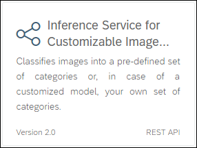

## Prerequisites
 - **Proficiency:** Beginner
 - [Sign up for an free trial account on the SAP Cloud Platform](https://www.sap.com/developer/tutorials/hcp-create-trial-account.html)

## Next Steps
 - Select your next tutorial from these SAP Leonardo Machine Learning groups: [SAP API Business Hub](https://www.sap.com/developer/groups/ml-fs-api-hub.html), [Java](https://www.sap.com/developer/groups/ml-fs-java.html) or [SAPUI5](https://www.sap.com/developer/groups/ml-fs-sapui5.html)
 - Select a tutorial group from the [Tutorial Navigator](https://www.sap.com/developer/tutorial-navigator.html) or the [Tutorial Catalog](https://www.sap.com/developer/tutorial-navigator.tutorials.html)

## Details
### You will learn
In this tutorial, you will learn where to find and test the **SAP Leonardo Machine Learning Functional Services** published on the SAP API Business Hub that consumes images content.

This service allows you to calculates and returns a list of classifications/labels along with their probabilities for a given image.

The **Image Classification** Machine Learning Functional Services will be used as an example to demonstrate how to consume image content, but you will be able to transpose this tutorial to other services which also consume images content like :

 - the **Image Feature Extraction API**
 - the **Product Image Classification API**

### Time to Complete
**10 Min**

[ACCORDION-BEGIN [Step 1: ](Search the SAP API Business Hub)]

In order to consume the **Image Classifier Service** SAP Leonardo Machine Learning Foundation service, you will first need to get the service URI, request and response parameters.

Go to [https://api.sap.com/](https://api.sap.com).


Then you will be able to search for the **SAP Leonardo Machine Learning - Functional Services**, then click on the package found.


Select **Inference Service for Customizable Image Classification**.



You can also access the page directly from the following address:

 - <https://api.sap.com/api/image_classification_api/resource>

[DONE]
[ACCORDION-END]

[ACCORDION-BEGIN [Step 2: ](Analyze the service)]

As you can notice the API has only one resource (or service): `/classification`.

Now click on the `/classification` link to expand the section.

> **Note**: the term *inference* refers to the application phase (scoring) an existing model (as opposed to the training or inception phase) and *sync* for synchronous.

As stated in the description, the service accepts either:

 - an archive file with a zip/tar extensions containing multiple image files
 - a single image
 - a list of image as input

The service returns a classification list with its scores (confidence).

The supported image formats are ***JPEG***, ***PNG***, ***TIF*** or ***BMP*** (the actual content format is validated, so renaming files may simply not work).

The input file, files or archive file will be sent as a `FormData` query parameter in the service request.

[DONE]
[ACCORDION-END]

[ACCORDION-BEGIN [Step 3: ](Test the service)]

In the top right corner of the page, click on the **Log On** button.

You will be prompted for your SAP Cloud Platform credentials.

Scroll down to the **Parameters** section and click on the **Choose File** button next to `files` parameter.

Select any image file on your local machine (and if you are missing some inspiration, use [Google Search](https://www.google.fr/search?q=duck&tbm=isch) to search for duck images).

Make sure you pick a ***JPEG***, ***PNG***, ***TIF*** or ***BMP*** format with a resolution below 1024 by 1024 pixels else you will receive a 400 error response.

Now, scroll down and click on **Try out**.

In the **Response Body**, you will get the top 5 classes/label with an associated score (that sums up to 1).

```JSON
{
  "_id": "xxxxxxxx-xxxx-xxxx-xxxx-xxxxxxxxxxxx",
  "predictions": [
    {
      "name": "Duck.jpeg",
      "results": [
        {
          "label": "drake",
          "score": 0.999675
        },
        {
          "label": "goose",
          "score": 0.000313
        },
        {
          "label": "European gallinule",
          "score": 0.000004
        },
        {
          "label": "toucan",
          "score": 0.000003
        },
        {
          "label": "red-breasted merganser",
          "score": 0.000002
        }
      ]
    }
  ],
  "processed_time": "Mon, 31 Jul 2017 13:03:29 GMT",
  "request": {
    "files": [
      "Duck.jpeg"
    ],
    "options": {},
    "tenantName": "imgclassif-tech-user",
    "texts": []
  },
  "status": "DONE",
  "tenantName": "imgclassif-tech-user"
}
```

[DONE]
[ACCORDION-END]

[ACCORDION-BEGIN [Step 4: ](Validation)]

Provide an answer to the question below then click on **Validate**.

[VALIDATE_1]
[ACCORDION-END]

### Optional

[ACCORDION-BEGIN [Step 5: ](Investigate similar services)]

You can also try the following Machine Learning Functional Services consuming images:

 - **Inference Service For Customizable Image Feature Extraction**
 - **Inference Service for Customizable Object Detection**
 - **Inference Service for Face Feature Extraction**
 - **Inference Service for Scene Text Recognition**
 - **Inference Service for Human Detection**
 - **Inference Service for Face Detection**

Alternatively, you can try to compress into a zip a series of images and call the service.

For more information, you can also check the online [SAP Leonardo Machine Learning Foundation documentation](https://help.sap.com/viewer/product/SAP_LEONARDO_MACHINE_LEARNING_FOUNDATION/1.0/en-US)

[DONE]
[ACCORDION-END]

## Next Steps
 - Select your next tutorial from these SAP Leonardo Machine Learning groups: [SAP API Business Hub](https://www.sap.com/developer/groups/ml-fs-api-hub.html), [Java](https://www.sap.com/developer/groups/ml-fs-java.html) or [SAPUI5](https://www.sap.com/developer/groups/ml-fs-sapui5.html)
 - Select a tutorial from the [Tutorial Navigator](https://www.sap.com/developer/tutorial-navigator.html) or the [Tutorial Catalog](https://www.sap.com/developer/tutorial-navigator.tutorials.html)
