## Details
### You will learn
- What annotations are and how they relate to OData
- What SAP Fiori elements are
- How annotations can be used to power a Fiori app

As a format and protocol, OData has many features. But there's a further dimension to OData that you'll discover in this tutorial. OData already comes with the concept of metadata, in the form of the metadata document.

The information in OData metadata documents you've seen in previous tutorials describes property names, types, whether they must have a value or not, and so on ... in other words, basic technical aspects. However, that information can be enriched through the addition of annotations, which can be managed in layers.

Annotations allow you to define additional characteristics that have meaning beyond the basic technical aspects in the metadata document.

- data processing: annotations can describe what operations are allowed
- display: annotations can enrich the metadata by providing information useful in building a user interface (UI)
- analytical: annotations can specify aggregation information, such as identifying properties that are dimensions or measures

Metadata annotations can be provided in different ways: directly within the entity type definitions, outside of the entity type definitions but still within a metadata document, or outside of a metadata document entirely. It might help to think of this being similar to how Cascading Style Sheets (CSS) work - style information can be specified in-line with HTML elements directly, or in the head of an HTML document, or in a separate file altogether.

In this tutorial, you'll become acquainted with some basic OData metadata annotations and also with SAP Fiori elements, a series of UI5-based dynamic UI components that are entirely driven by annotations. You'll briefly examine existing annotations in an OData service, create a SAP Fiori elements app based on an Enterprise Procurement Model (EPM) OData service from the Gateway Demo system, and declare some annotations to drive the app's display.

> The steps you'll follow are similar to those in a previous tutorial [Use SAP Web IDE OData features to create a simple app](https://www.sap.com/developer/tutorials/odata-03-webide-odata-features.html), so the detail in the equivalent steps in this tutorial will be kept to a minimum.

> In this tutorial and others the general name "SAP Web IDE" is used. Specifically, the "Full-Stack" version is implied throughout.

---

[ACCORDION-BEGIN [Step 1: ](Examine EPM Shop OData service metadata)]

To start off, take a fresh look at the metadata in the OData service that you looked at in the tutorial [Continue your OData exploration with EPM](https://www.sap.com/developer/tutorials/odata-02-exploration-epm.html) - the shop reference app OData service. Open the following URL:

`https://sapes5.sapdevcenter.com/sap/opu/odata/sap/EPM_REF_APPS_SHOP_SRV/$metadata`

Find the definition of the `Supplier` entity type, and look at the attributes in the XML.

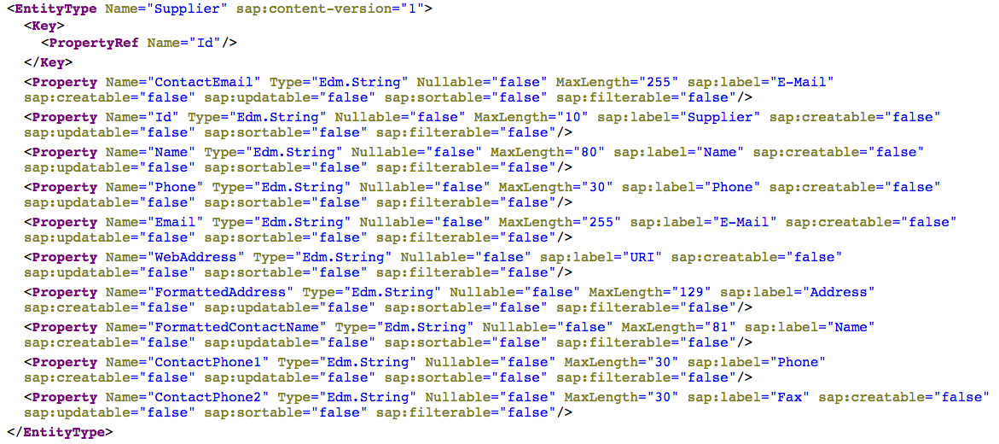

You'll notice that as well as the core attributes, such as `Name` and `Type`, there are attributes in the `sap` namespace, such as `label`, `creatable` and `updatable`. These are basic annotations that are already part of the metadata document, built directly into this entity type definition.

> If you're wondering, the `sap` namespace is defined as `http://www.sap.com/Protocols/SAPData` in the root `Edmx` element of the metadata document itself.

Look further down in the metadata document, and you'll find annotations declared explicitly, for different target entity types. Here's an example, where annotations are provided for the `Review` entity type:

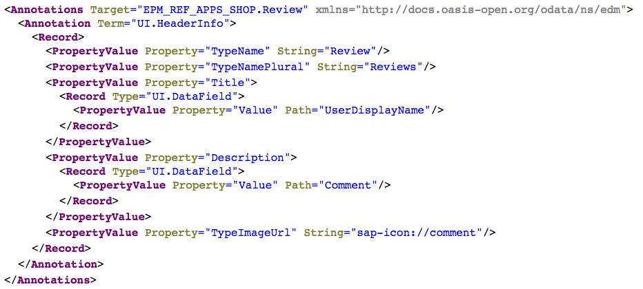

Rather than being directly embedded within the entity type definition, these annotations are separately defined, but are still within the metadata document. Briefly, these particular annotations provide information at the UI level, such as what the singular and plural names are for the `Review` entity type, and properties that should be displayed at the semantic "title" level in a UI.

[VALIDATE_1]
[ACCORDION-END]

[ACCORDION-BEGIN [Step 2: ](Start up the SAP Web IDE)]

Access the SAP Web IDE from your trial SAP Cloud Platform cockpit. Use the details in the tutorial [Enable SAP Web IDE Full-Stack](https://www.sap.com/developer/tutorials/webide-multi-cloud.html) to find out how to access it, or simply invoke it using a URL which will look like this:

`https://webidecp-XYZ.dispatcher.hanatrial.ondemand.com/`

Here, `XYZ` represents your trial subaccount name, such as `p999999trial`.

[DONE]
[ACCORDION-END]

[ACCORDION-BEGIN [Step 3: ](Initiate a new project from template)]

Once you start the SAP Web IDE, use menu path **File** > **New** > **Project from Template** to start the template wizard. In the **Template Selection** step, choose the category **SAP Fiori Elements**, select the **List Report Application** template and proceed with **Next**.

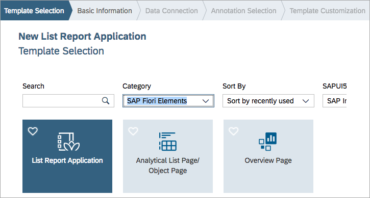

[DONE]
[ACCORDION-END]

[ACCORDION-BEGIN [Step 4: ](Enter basic information)]

In the **Basic Information** step of the wizard, enter the following:

Field            | Value
:--------------- | :-------------
Project Name     | `SupplierData`
Title            | `Supplier Overview`

You can leave the values for the other fields empty. Select **Next** to continue.

[DONE]
[ACCORDION-END]

[ACCORDION-BEGIN [Step 5: ](Specify the OData service)]

In the next step in the wizard, **Data Connection**, you get to specify an OData service upon which the app is to be based.

Select the **Service Catalog** source, then find and choose the `SAP_Gateway` destination. You will have created this destination in the tutorial [Create a destination for the SAP Gateway Demo system](https://www.sap.com/developer/tutorials/teched-2016-3.html).

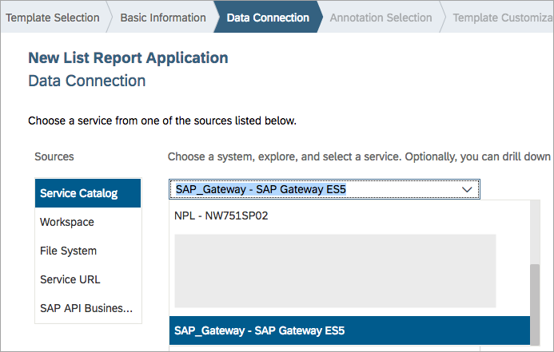

What happens now is that the SAP Web IDE uses the OData catalog service, which is itself an OData service, to retrieve a collection of services available. It can then present the available OData services in a list for you to select from.

Find the `EPM_REF_APPS_SHOP_SRV` service by filtering for **shop** like this:

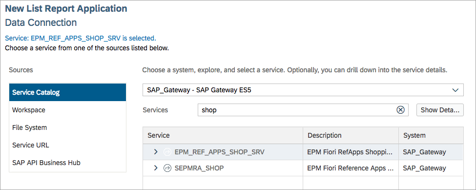

> In case you're curious, the OData service providing the service catalog information in an ABAP stack SAP Gateway system like this one is `/IWFND/CATALOGSERVICE;v=2`.

[DONE]
[ACCORDION-END]

[ACCORDION-BEGIN [Step 6: ](Explore the OData service)]

At this point you can explore the service with the **Show Details** button, in a similar way you might have proceeded in the tutorial [Use SAP Web IDE OData features to create a simple app](https://www.sap.com/developer/tutorials/odata-03-webide-odata-features.html).

This time, select the `Suppliers` entity set, and in the entity set details shown, notice the **Annotations** tab that shows which data processing operations are supported.

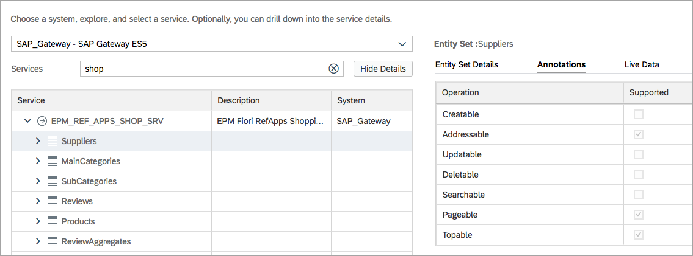

> Notice also that you can actually preview live data from the OData service in the "Live Data" tab.

When you're ready, move on to the next step in the wizard.

[VALIDATE_6]
[ACCORDION-END]

[ACCORDION-BEGIN [Step 7: ](Check the annotation selection)]

In the next step, **Annotation Selection**, the wizard queries the catalog service for the chosen OData service to see if any external annotations exist. It has already examined the OData service's metadata document.

In the case of this particular OData service `EPM_REF_APPS_SHOP_SRV` there are no external annotation resources, but as you saw earlier in this tutorial, there are some annotations within the metadata document itself.

So in this step of the wizard you are shown a single entry representing this embedded metadata (**Selected Service Metadata**), and given the chance to specify further external annotation sources.

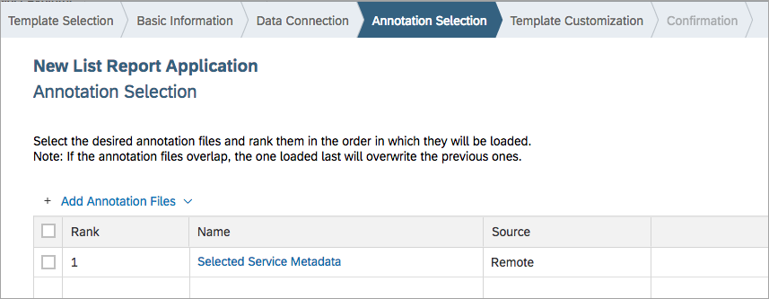

You'll be adding external annotations shortly, so don't specify anything further here and move on to the next step with **Next**.

[DONE]
[ACCORDION-END]

[ACCORDION-BEGIN [Step 8: ](Customize the template)]

Now it's time to specify what data you want your app to display. This is done in the **Template Customization** step of the wizard.

To keep things simple, just choose the `Suppliers` entity set for the main (mandatory) OData collection and leave the other fields as they are. The focus of this tutorial is annotations, so we won't bother with any navigation.

When you're ready, select **Finish** to end the wizard.

[DONE]
[ACCORDION-END]

[ACCORDION-BEGIN [Step 9: ](Explore the app immediately)]

You can run the app immediately, by using the context menu on the new `SupplierData` project in your workspace:

`Run -> Run as -> SAP Fiori Launchpad Sandbox`

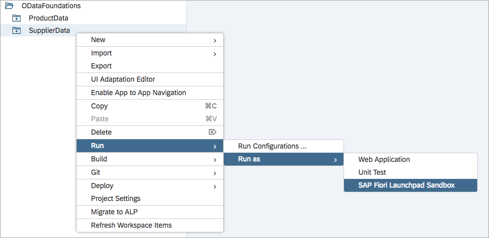

Once the app is displayed, selecting the **Go** button reveals empty lines of data, showing that there are not enough annotations to properly drive this app.

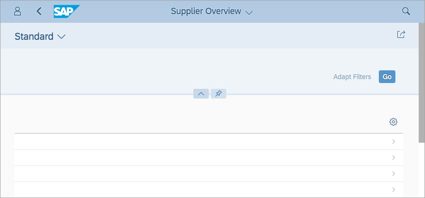

Remembering that this is an SAP Fiori elements app (you chose a template from the **Fiori Elements** category in the wizard), consider what this means: in contrast to the app generated by the wizard in the tutorial [Use SAP Web IDE OData features to create a simple app](https://www.sap.com/developer/tutorials/odata-03-webide-odata-features.html), which contains many artifacts including XML views and JavaScript controllers, this app has very few.

Have a look for yourself by expanding the folders within the `SupplierData` project in your workspace. The `webapp/` folder contains only a small number of items, with the most important being the `Component.js` and the `manifest.json` files.

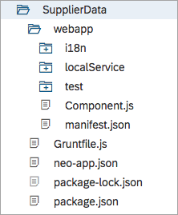

Instead of starting out with basic views and controllers, and continuing to modify them to shape the UI that you want for your app in a so-called "freestyle" fashion, you will take a declarative approach and define annotations to enrich the metadata, which the SAP Fiori elements engine will use to form what the app looks like and how it behaves.

[DONE]
[ACCORDION-END]

[ACCORDION-BEGIN [Step 10: ](Add a new annotation file)]

It's time to add some annotations.

Use the context menu on the `webapp/` folder and select **New** > **Annotation File**.

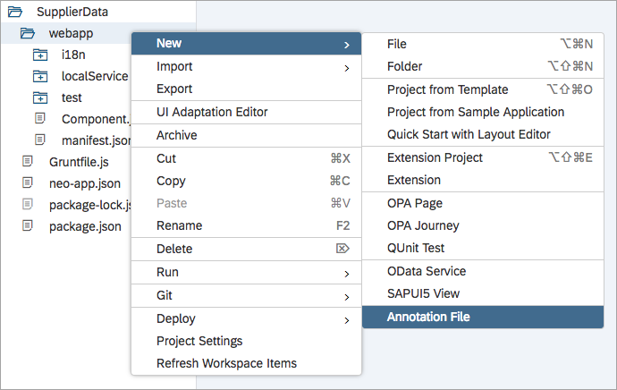

Leave the values for the fields in the wizard as they are, and follow the wizard through to completion.

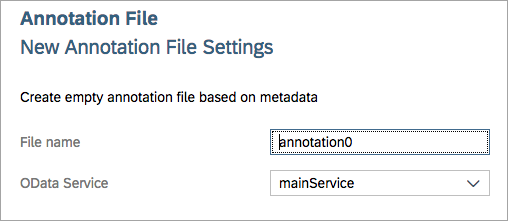

You'll see a new file, `annotation0.xml` in the `webapp/` folder, and this file will have been registered in the app descriptor file `manifest.json`, associating it with the OData service.

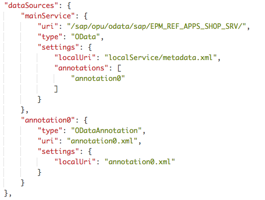

In other words, this will be an external set of annotations to enhance the metadata of the OData service.

[VALIDATE_10]
[ACCORDION-END]

[ACCORDION-BEGIN [Step 11: ](Add line item annotations)]

The first annotations to add should introduce columns of data into the app's main display. You'll specify annotations that will drive this display, to have the supplier name with a hyperlink to their website, and the supplier address, like this:

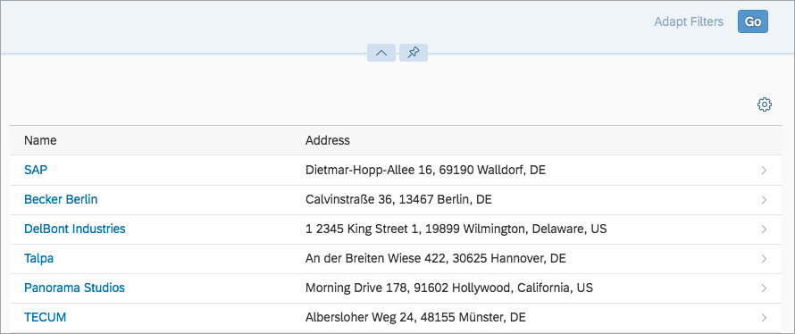

Open up the `annotation0.xml` file -- the default editor that is used if you simply double-click on the filename is the built in Annotation Modeler, and it's much easier than editing the annotation XML directly!

The editor is ready for you to add annotations for the `Supplier` entity type (it's possible to select other annotation targets, but `Supplier` is what you want here).

> The `Local Annotations` node is where you will be creating the annotations; in other words, they are "local" to this external file, as opposed to "remote", based inside the metadata document.

Use the plus symbol on the right to add a local annotation, specifically the `LineItem` annotation from the `UI` vocabulary:

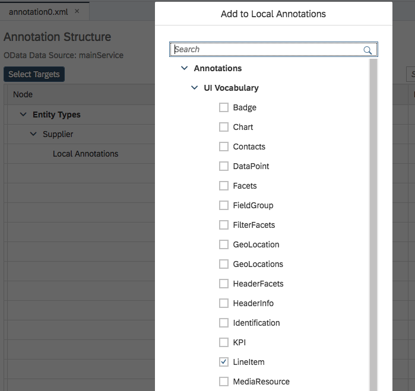

Now create a node within the `UI.LineItem` by using its plus symbol and choosing `DataFieldWithUrl` from the dialog box that appears -- the dialog box will be similar to the previous one, but with different choices.

> Make sure you are using the right plus buttons each time you add annotations

This `UI.DataFieldWithUrl` annotation will allow the specification of a value (for the supplier name) and a URL to link to. In the entry boxes that appear, specify the properties from the `Supplier` entity type as shown below (note that you'll need to change the `Expression Type` for the `Url` annotation value from **`String`** to **`Path`** too).

In addition, at the `UI.LineItem` level, use the plus symbol to add a second node, this time a simple `DataField` node (rather than a `DataFieldWithUrl` node). Specify the property `FormattedAddress` in the **Property** field.

This is what you should end up with:

Save the annotations and run the app again to see the effect. You can use the green "run" button near the top of the Web IDE, or even refresh the tab in your browser if you still have the app there.

The display should resemble the screenshot at the start of this step (don't forget you'll need to select the **Go** button in the app to retrieve and display the supplier data).

[VALIDATE_11]
[ACCORDION-END]

[ACCORDION-BEGIN [Step 12: ](Add a presentation variant annotation)]

The suppliers aren't presented in a sorted order. Fix this by adding another local annotation, in the same way you did in the previous step. You'll be adding a `SortOrder` specification within a `UI.PresentationVariant` annotation.

Use the plus symbol at the "Local Annotations" level to add a new node, but this time, rather than `LineItem`, choose the `PresentationVariant` annotation from the `UI` vocabulary. Then using the plus symbol at this new `UI.PresentationVariant` level, add a `SortOrder` property. Within that (using the plus symbol at that level) you must then add a `SortOrderType`.

Once you do this, and then also specify the property `Name` for the property within the `SortOrderType` node, this is what it should look like:

Rerun or refresh the app and you should see the same display as before, but with the entries sorted by company name.

[DONE]
[ACCORDION-END]

[ACCORDION-BEGIN [Step 13: ](Add header information annotations)]

The final annotation you will add is one that will adorn the app display with appropriate header information. So far the app is displaying a list of names and addresses, but it's not clear what type of business entities they are.

In a similar way to the previous two steps, add a `UI.HeaderInfo` annotation by using the plus symbol at the `Local Annotations` level again. You'll see that you need to specify three different values, so complete them as shown here:

The values are:

- the singular form of the entity type ("Supplier")
- the plural form of the entity type ("Suppliers")
- the property that is to be displayed in the Title section of the page that the app navigates to when an individual item is selected

Save the annotations and rerun or refresh the app again. Note that now, there is a header at the top of the list:

Also, when an individual item from the list is selected, the app navigates to the display of the individual object, and the value of the supplier's `Name` property is displayed as that object page's title:

This last annotation brings the introductory journey to an end. There's plenty more to discover with annotations and SAP Fiori elements - a good place to start is the [SAP Fiori elements wiki page](https://wiki.scn.sap.com/wiki/display/Fiori/Fiori+Elements) in the SAP Community.

[DONE]
[ACCORDION-END]
