## Details
### You will learn  
- How to create an analytical list page report

---

[ACCORDION-BEGIN [Step 1: ](Log into SAP Fiori launchpad)]
First you need to log into the SAP Fiori launchpad.

1. Double clicks on the **Remote Desktop icon** on the taskbar of your windows desktop.

    

2. The Remote Desktop Connection gets open and you are redirected to the SAP FIORI Launchpad.

    You should see this page:

    

3. Login now with your user and password

> Your user is `S4HANAPUT-XX` where **XX** is your desktop number. Your password will be given to you by your instructors.

[DONE]
[ACCORDION-END]

[ACCORDION-BEGIN [Step 2: ](Execute the Report Workspace)]
In the SAP Fiori launchpad, go to group **Report Design** and double-click the app **Report Workspace**.

[DONE]
[ACCORDION-END]

[ACCORDION-BEGIN [Step 3: ](Get started with report creation)]
1. After you have successfully executed the App Report Workspace, the below window gets open.

    

2. In the Report Workplace window, click on the + Add on the bottom left toolbar to create your report as depicted below:

    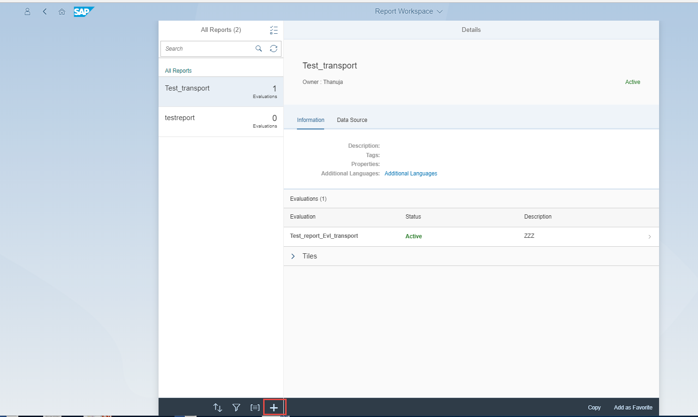

[DONE]
[ACCORDION-END]

[ACCORDION-BEGIN [Step 4: ](Maintain report parameters)]

Maintain the fields on the window as following:

  - **Title:** **`ZZ1_APSEMTAGSTATISTIC_XXXX`**
> Replace XXXX with your initials

  - **CDS View:** Query created in the previous tutorial, and then select OData Service and Entity Set from the value help.
> If you did not create your own query, you can use:

    |  Field Name         | Value
    |  :------------------| :-------------
    |  CDS View           | `ZC_APSEMTAGSTATISTICAL`
    |  OData Service      |`/sap/opu/odata/sap/ZC_APSEMTAGSTATISTICAL_CDS`
    |  Entity Set         | `ZC_APSEMTAGSTATISTICALResults`

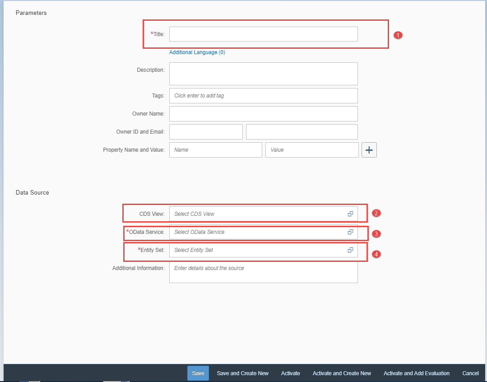

[DONE]
[ACCORDION-END]

[ACCORDION-BEGIN [Step 5: ](Activate report)]

1. Click **Activate and Add Evaluation**.
>Please activate before save. If not you would have to return to the Edit modus again !

2. Click on local object as transport request.

    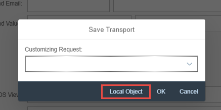

[DONE]
[ACCORDION-END]

[ACCORDION-BEGIN [Step 6: ](Create report evaluation)]

1. Set the field **Evaluation** to **`ZAPSEMTAGSTATISTIC_XXXX`**.

    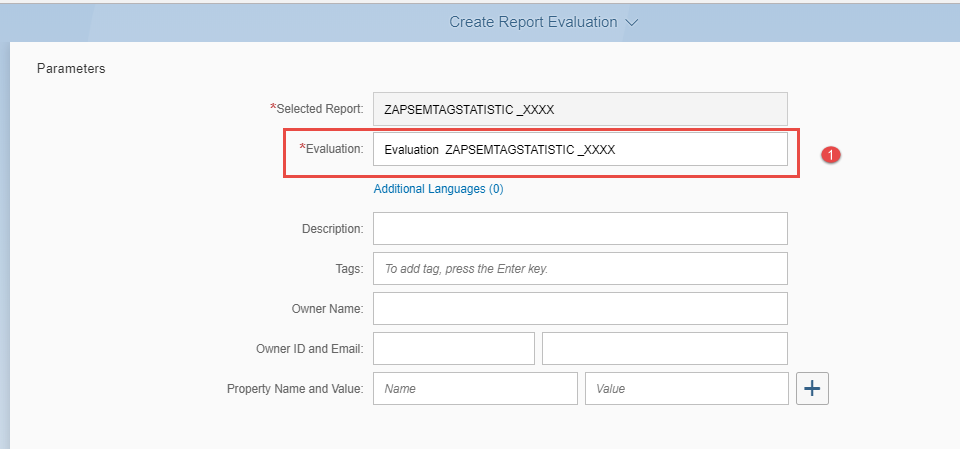

2. Set **Scaling Factor** under **Report Data Source** to `Auto`, and **Decimal Precision** to `Auto`.

    

3. Maintain the following fields of the **Input Parameters** and **Filters** as follow:

    |  Field Name                | Value
    |  :------------------       | :-------------
    |  To-Period                 | `7`
    |  Category                  | `ATC01`
    |  Fin Statement Version     | `L000`
    |  Fiscal Year               | `2018`
    |  Controlling Area          | `A000`

    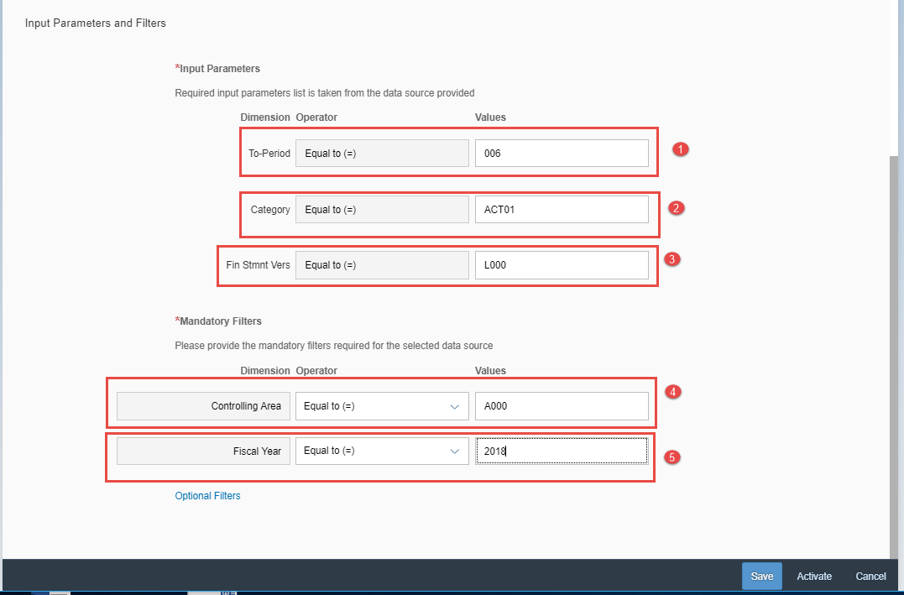

4. Click **Activate**.

[DONE]
[ACCORDION-END]

[ACCORDION-BEGIN [Step 7: ](Explore report details)]

1. On the **Report Workspace** screen, select your report on the left, by marking the entry in **My Last Worked On**.

2. The details of your report are shown on the second column of the **Report Workspace** screen.

    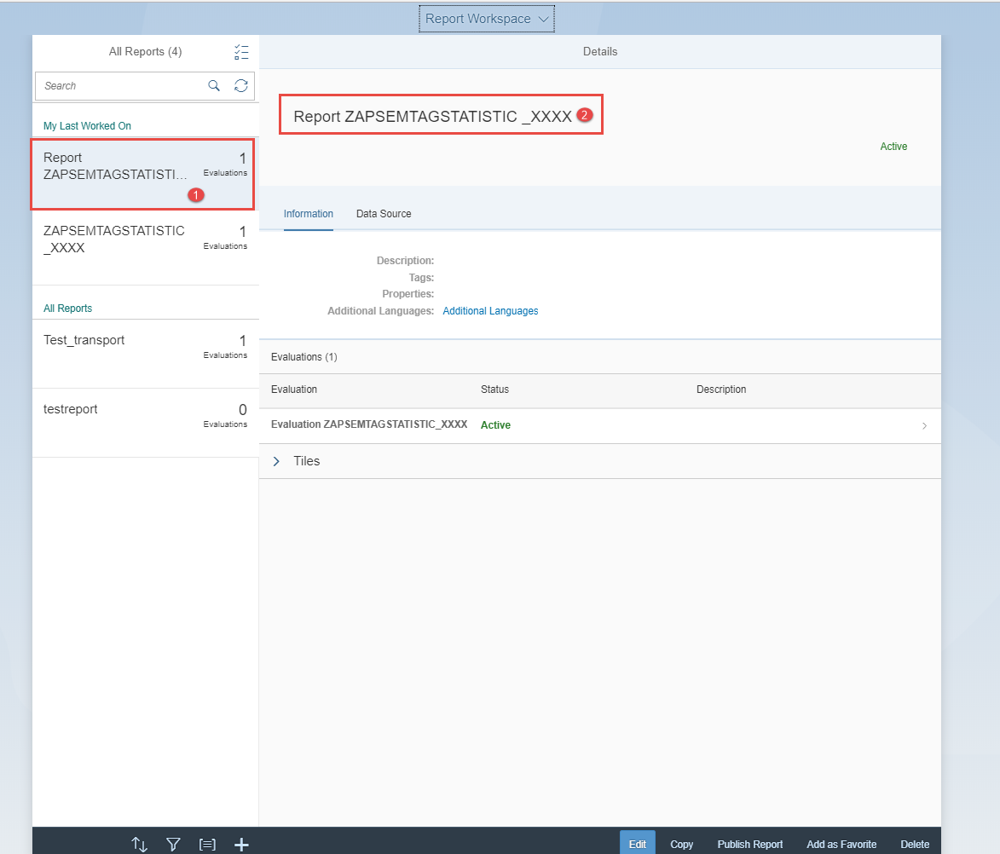

3. Click **Publish Report**.

    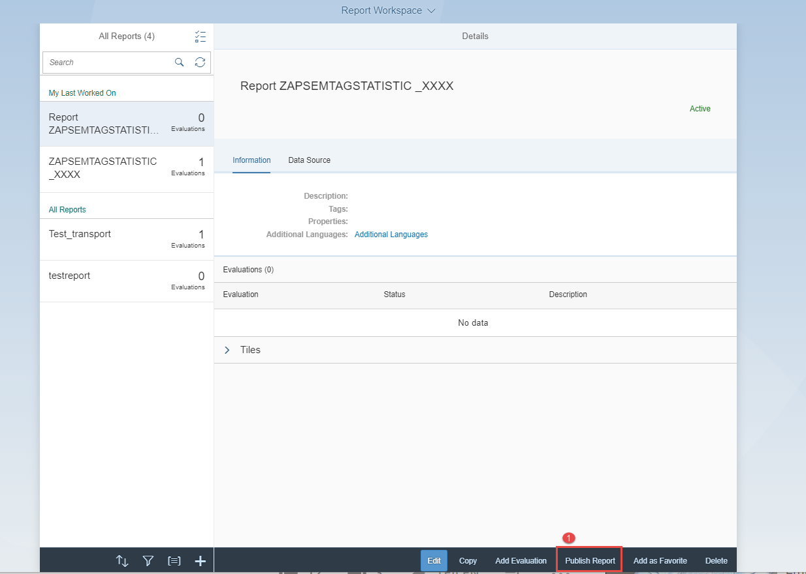

[DONE]
[ACCORDION-END]

[ACCORDION-BEGIN [Step 8: ](Publish and configure report tile)]

1. In the **Publish Report** screen, as shown below:

    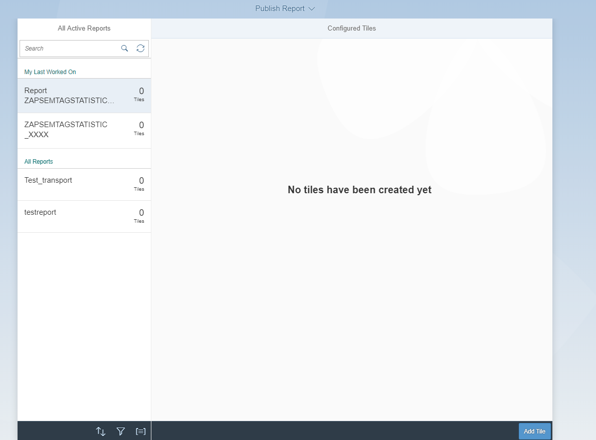

    click **Add Tile**.

    

3. Maintain the following fields:

    |  Field Name         | Value
    |  :------------------| :-------------
    |  Title              | `ZAPSEMTAGSTATISTIC_XXXX`
    |  Subtitle           | `2018_XXXX`
    |  Catalog            | `X-SAP-UI2-CATALOGPAGE:Z_MONJE_TEC`
    |  Semantic Object    | `CostCenter`
    |  Action             | `analyzeALP_XXXX`

    

4. Click **Save and Configure Drill-Down**. The **Drill-Down Configuration Details** screen opens, showing an empty screen with the message **No drill-down has been configured**.

    

>Replace XXXX with your initials!  

[VALIDATE_2]
[ACCORDION-END]

[ACCORDION-BEGIN [Step 9: ](Configure report drill-down)]

Select your report on the left by selecting the entry in **My Last Worked On** section. Details of your report are shown on the right.

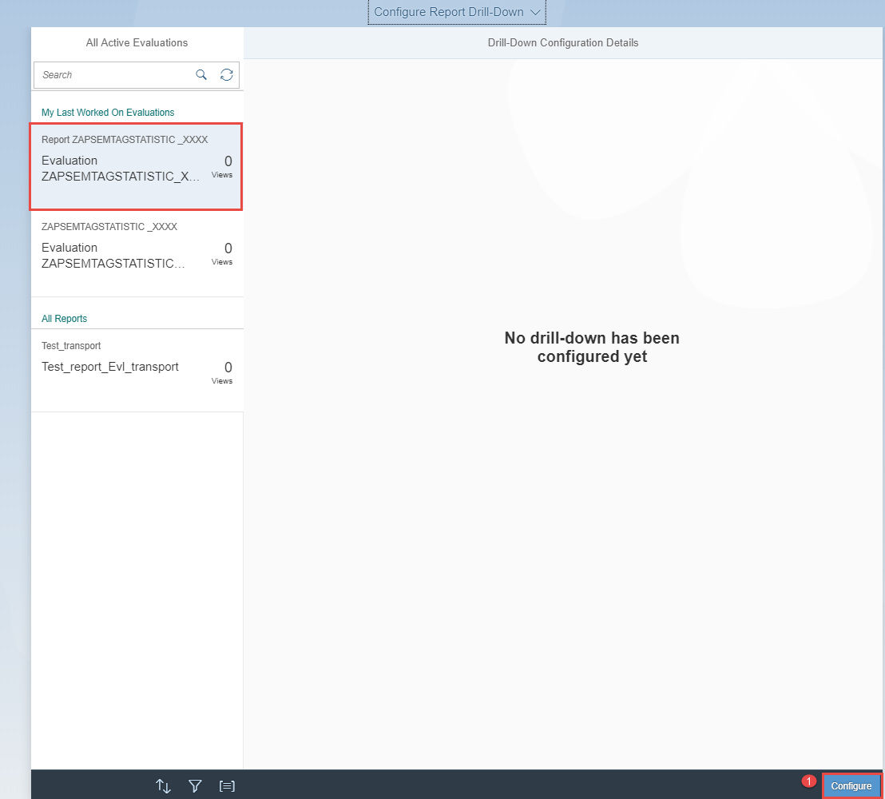

Click **Configure**.

[DONE]
[ACCORDION-END]

[ACCORDION-BEGIN [Step 10: ](Configure charts)]

1. Select the dimensions to be shown on the chart axis (e.g., Cost Center), and then click **OK**.

    

    A bar chart similar to the one below is shown with dummy data

    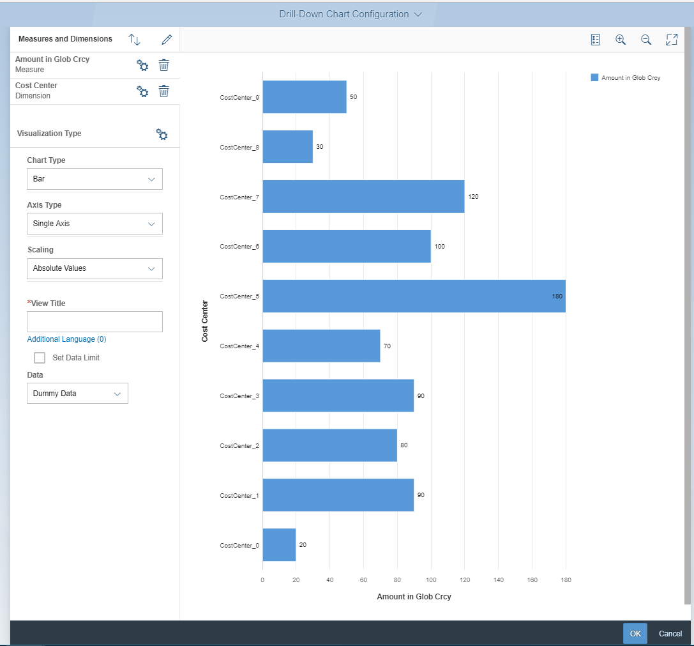

3. If you want, change the chart type to explore.

[DONE]
[ACCORDION-END]

[ACCORDION-BEGIN [Step 11: ](Maintain chart properties)]

Set the field **View Title** to **`By Cost Center`** and click **OK**. The left panel is hidden, and the chart is shown in full screen mode.

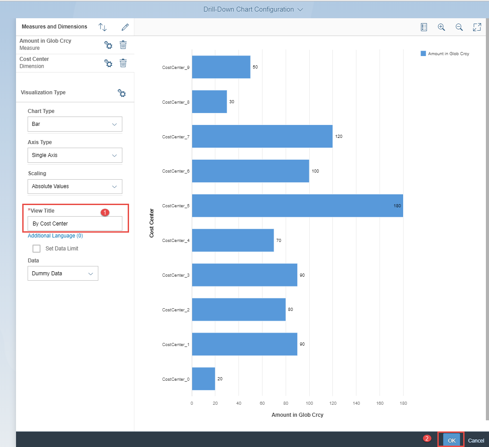

A new toolbar is added on top (in the right corner).

[DONE]
[ACCORDION-END]

[ACCORDION-BEGIN [Step 12: ](Configure table)]

Click **+** on the top right to configure the table.

A **Select** screen with dimension fields opens, similar to this:

> The Measure **`Amount in Glob Crcy`** is selected by default.

[DONE]
[ACCORDION-END]

[ACCORDION-BEGIN [Step 13: ](Select dimensions and measures)]

1. In the **Select** screen, check the dimensions and measure fields as on the picture below.

    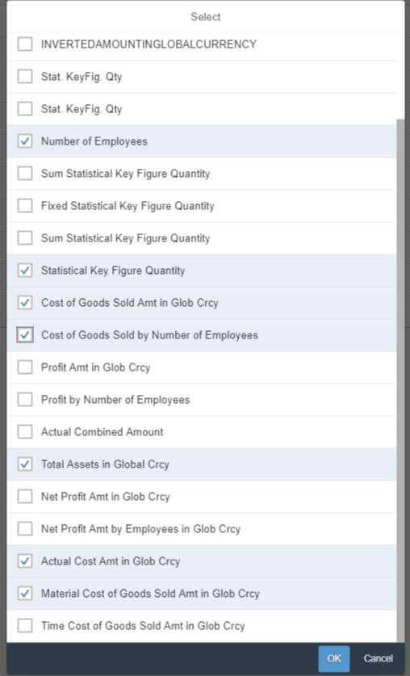

2. Click **OK** to validate the fields selection. A screen similar to the one below showing the configured table details is displayed.

    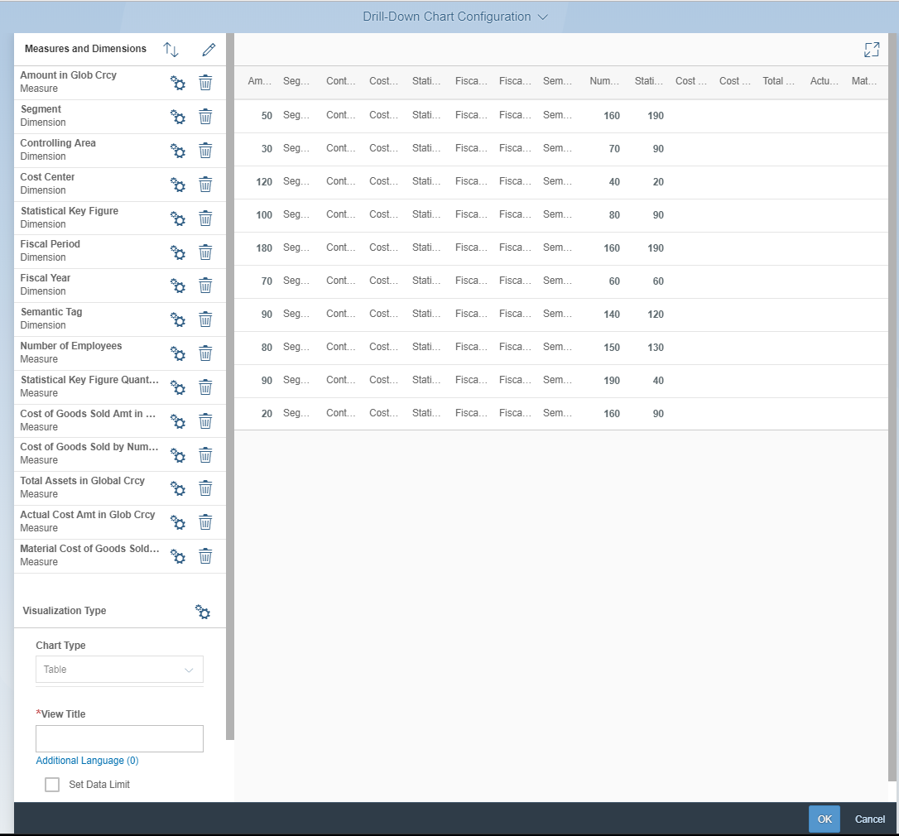

[DONE]
[ACCORDION-END]

[ACCORDION-BEGIN [Step 14: ](Maintain table details)]

1. Set the **View Title** field to **`By Cost Center`** and click **OK**.

    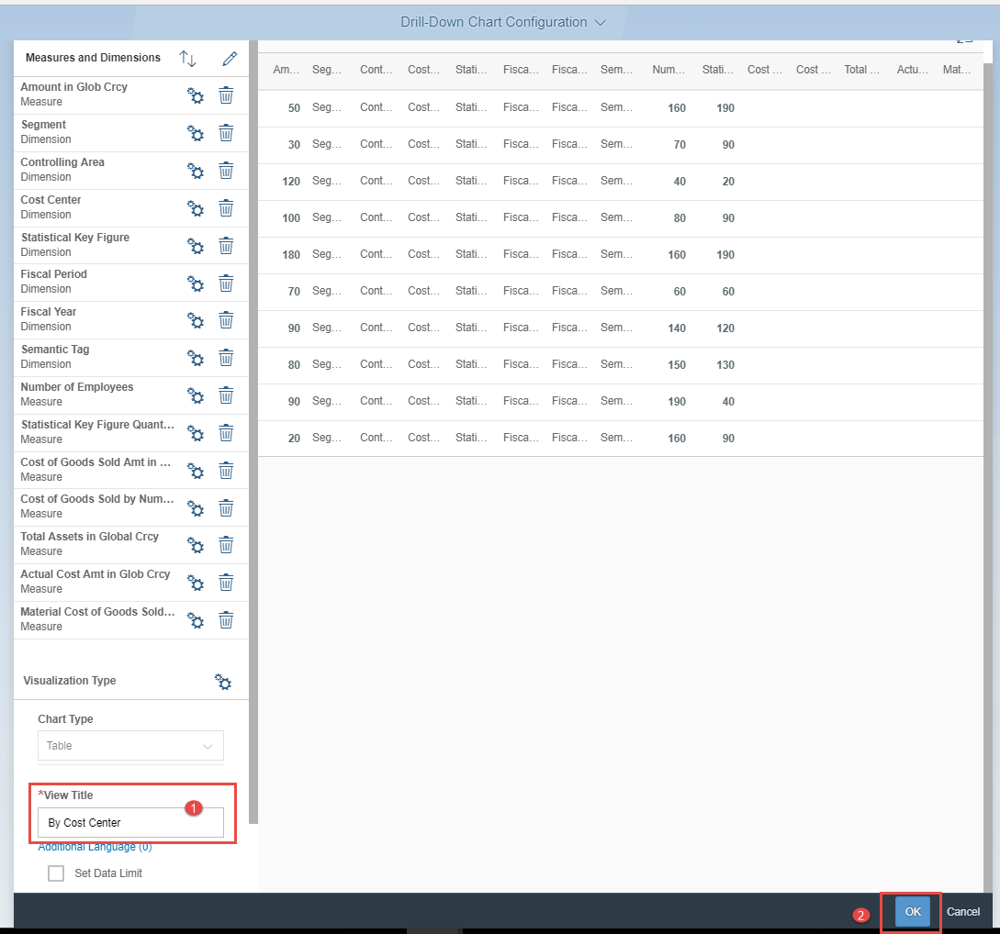

2. The left panel is shown full screen and a new toolbar is added on top.

    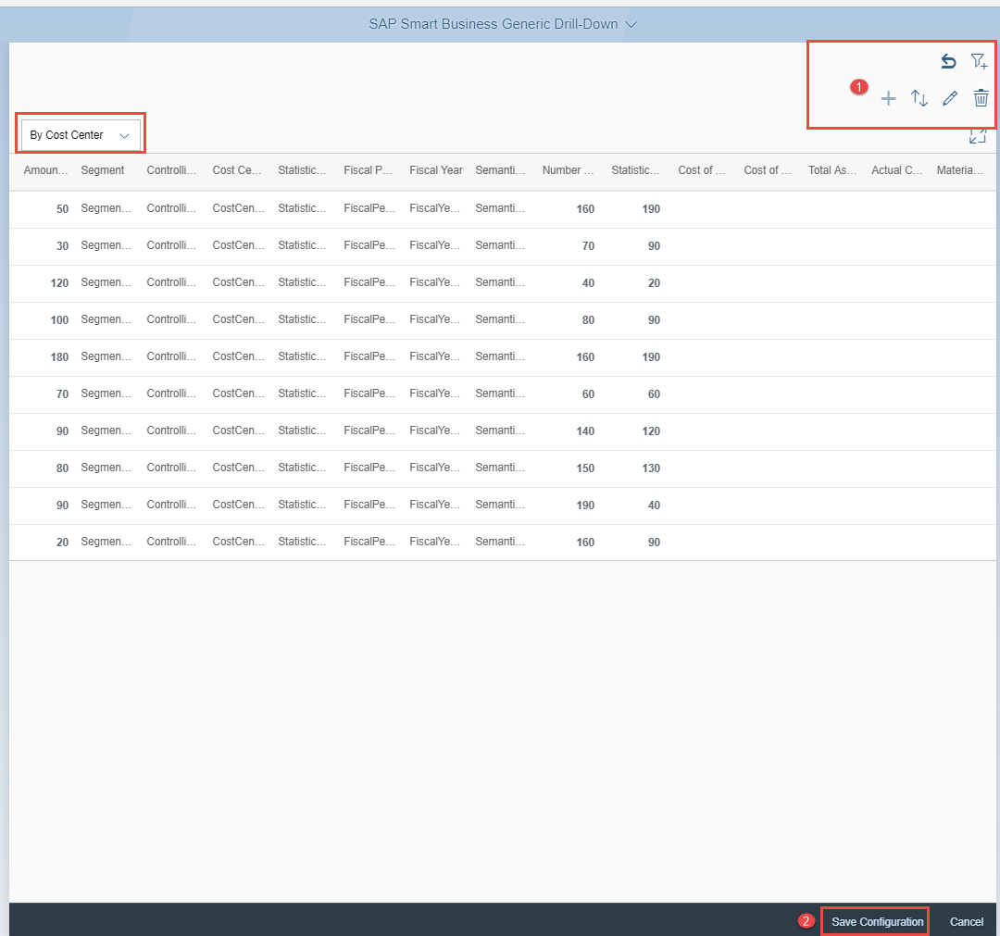

3. Click **Save Configuration**.

[DONE]
[ACCORDION-END]

[ACCORDION-BEGIN [Step 15: ](Preview table and charts)]

1. On the left is the **All Active Evaluations** panel, and on the right shows the preview of your chart and table. Switch between them with the drop-down list box.

    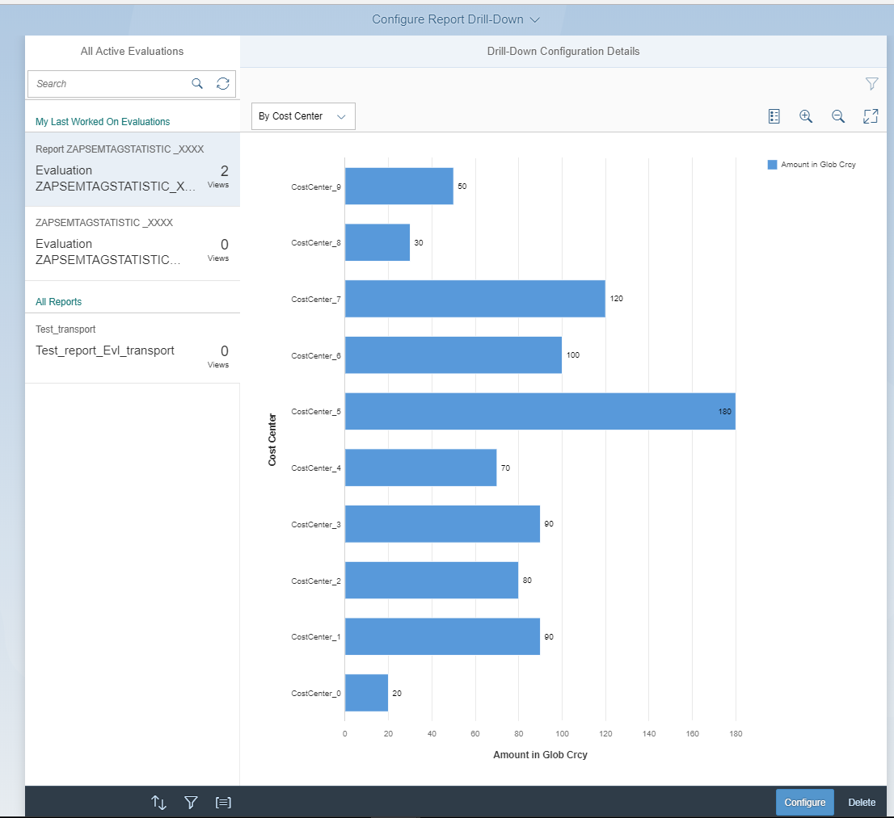

2. Switch the drop-down to show:

    - the chart
    - the table

    

You have now completed the configuration of your analytical list page.

[DONE]
[ACCORDION-END]

[ACCORDION-BEGIN [Step 16: ](Execute report)]

1. Return to the SAP Fiori launchpad, click on the **Me** icon (top-left corner next to the SAP logo). The **Me** area opens on the left.

    

2. Click the App Finder to open it.

3. Search for **`ZZ1_APSEMTAGSTATISTIC_XXX`** (top-right corner). The tile for your report will be displayed or look for it under the catalog **Catalog TechEd AppSpace**

4. Click the tile to start the report.

5. The analytical list page shows up with a chart and table as you have configured in the previous step.

[VALIDATE_3]
[ACCORDION-END]
