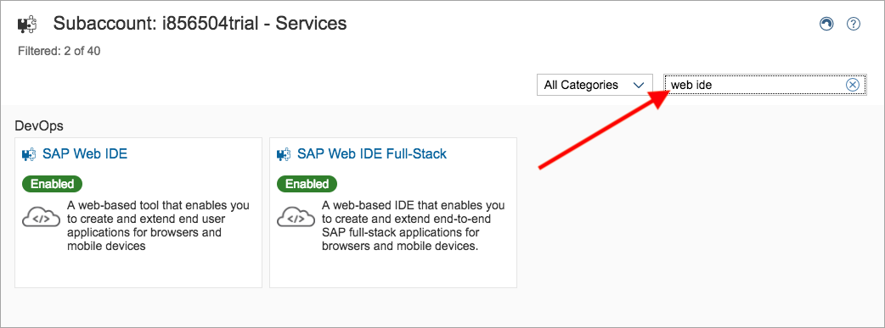
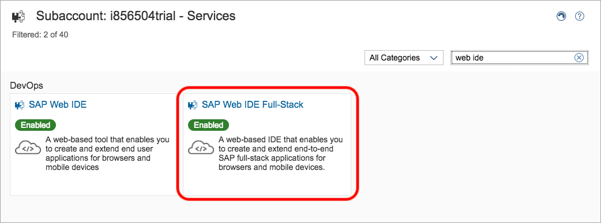
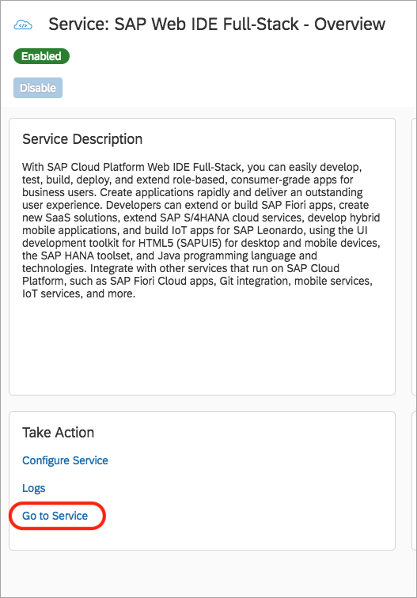

## Details
### You will learn  
  - How to enable SAP Web IDE Full-Stack

You can use many different tools to build and deploy apps on the SAP Cloud Platform, but we recommend SAP Web IDE, a service of SAP Cloud Platform. In this tutorial, you'll locate it, enable it, and access it, all from your browser, without needing to install anything.

---

[ACCORDION-BEGIN [Step 1: ](Open SAP Cloud Platform services)]
Open your SAP Cloud Platform account. Make sure you are in a `Neo` Environment, not one of the new Cloud Foundry environments. `Neo` is the classic, proprietary SAP Cloud Platform.

Go to **Services**.

[DONE]
[ACCORDION-END]

[ACCORDION-BEGIN [Step 2: ](Find SAP Web IDE Full-Stack)]
In the service catalog, search for **Web IDE**.

Select the **SAP Web IDE Full-Stack** service.

[DONE]
[ACCORDION-END]

[ACCORDION-BEGIN [Step 3: ](Enable the service)]
Once the service page loads, enable the service. This may take a few minutes.

Wait for the status to change to the green, **Enabled** status.

[DONE]
[ACCORDION-END]

[ACCORDION-BEGIN [Step 4: ](Open SAP Web IDE)]
Once the service is enabled, click **Go to Service**. This opens the new, full-stack SAP Web IDE.

The full-stack version of SAP Web IDE includes some new features. You will explore them in the following tutorials.

Copy and paste the URL from your SAP Web IDE Full-Stack window into the text box below.

[VALIDATE_4]
[ACCORDION-END]

### Optional

[ACCORDION-BEGIN [Step 5: ](Troubleshooting)]
Are you having trouble opening SAP Web IDE Full-Stack? If you are seeing a 501/503 error, it may be that your principal propagation flag is not set properly.

To enable your principal propagation flag, in your SAP Cloud Platform cockpit, click **Security** and then **Trust**.

If the **Principal Propagation** flag is set to _Default_ or _Disabled_, you will need to update it. Click **Edit**.

Change the value of **Principal Propagation** to _Enabled_ and click **Save**.

Now, go back to step 4 and try again to open the SAP Web IDE Full-Stack.

[DONE]
[ACCORDION-END]
